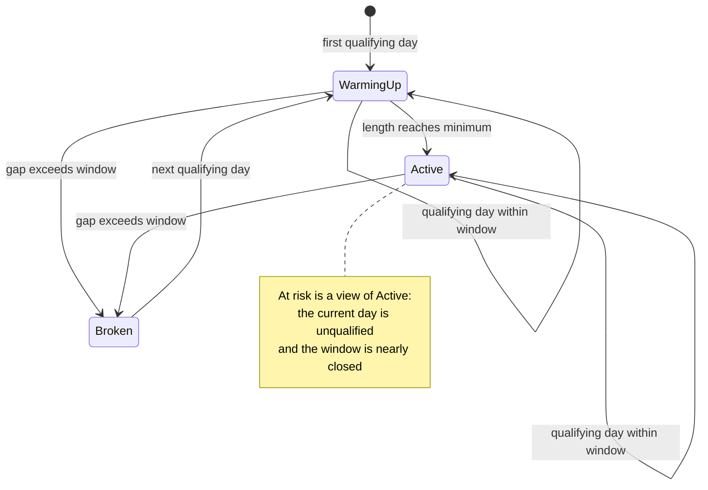

# Streak System — Requirements

## Summary

A multi-type streak system that rewards consistency with the ledger, delivered in phases: tracking streak first, then no-spend and app-open consistency streaks, then an under-budget streak. All types share one qualifying-run engine and surface as a home flame card plus a streaks page matching the Financial Atelier design.

## Problem Frame

Expense logging is bursty by nature: people record transactions in clusters, and a day with no spending is a good day that leaves nothing to log. A strict "log every day" streak therefore punishes exactly the behavior a personal finance app should reward, and trains users to log fake entries to keep a flame alive.

Streaks in the design are presented as achievements ("14 Day Streak — Mastering Financial Discipline"). To be honest achievements rather than engagement pressure, the mechanic must forgive short lapses, only celebrate a real habit, and never reward data pollution.

## Key Decisions

- **Forgiving grace window over strict daily logging.** A run breaks only after a gap longer than the window (default 3 days). This keeps no-spend days and weekend catch-ups from destroying progress.
- **Minimum display threshold.** A streak celebrates only from day 3 (configurable); below that the UI frames it as warming up. The window makes streaks forgiving, the minimum keeps them meaningful.
- **Calendar-days counting.** The streak number counts calendar days covered by the run (logs on Mon and Wed with a 3-day window read as a 3-day streak), matching the "14 Day Streak" hero in the design.
- **One shared hidden config.** A single long-press on any streak element opens one config sheet with a section per streak type, opened at that element's section. The existing easter-egg ritual stays separate as app identity.
- **Hybrid under-budget scoring.** Completed months qualify on total spend vs total expected budgets; per-category overruns are flagged on the page without resetting the streak. The in-progress month shows an on/off-track preview and never changes the count.
- **Derived-only streak counts.** Streaks always recompute from the underlying records; nothing about a streak is stored. Backdated entries can extend or heal runs retroactively. The future rewards layer will introduce its own persisted unlock state (e.g., best-ever streak) — this principle applies to counts, not rewards.
- **Phased delivery.** Phase 1: tracking streak, config, home card. Phase 2: no-spend and app-open streaks. Phase 3: under-budget streak. Rewards later still.

## Requirements

**Streak engine**

- R1. A streak is a run of qualifying days; its length counts calendar days covered by the run, from first to last qualifying day.
- R2. A gap between consecutive qualifying days up to the type's window (default 3) does not break the run.
- R3. Window and run math use local calendar dates, never raw timestamps.
- R4. Each run carries a status: `warming up` below the minimum (default 3), `active` at or above it, and `at risk` when the run would end unless the user qualifies before the window closes.
- R5. A streak is celebrated only at or above the minimum; below it the UI frames it as warming up.
- R6. Every streak type is defined solely by a qualifying rule over records; one engine computes all types identically from that rule.
- R7. Streak values are always recomputed from the underlying records. Backdated records can extend or heal the current run retroactively.

**Configuration**

- R8. All streak settings live behind one hidden surface: long-pressing any streak element opens the single config sheet at that type's section.
- R9. Settings include the tracking window and minimum and each type's cadence where applicable; defaults: window 3, minimum 3, app-open cadence 7.
- R10. The app-open cadence accepts presets 1, 2, 3 plus a custom value; cadence 1 means qualifying every day.

**Streak types**

- R11. Tracking streak (phase 1): a day qualifies when at least one transaction is recorded against it.
- R12. No-spend streak (phase 2): a day qualifies when no expenses are recorded against it.
- R13. App-open consistency streak (phase 2): qualifying is defined by opening the app; consecutive qualifying opens spaced within the cadence N keep the run.
- R14. Under-budget streak (phase 3): monthly cadence; a completed month qualifies when total recorded expenses are within the total expected category budgets; the in-progress month shows an on/off-track preview and never changes the count.

**Presentation**

- R15. Home shows a compact streak card: flame, "N Day Streak", a subtitle carrying at-risk or next-milestone context, and progress toward the next milestone.
- R16. A streaks page shows per type: hero counter, a month calendar of qualifying days, and a consistency rate for the month.
- R17. Months that qualified while individual categories exceeded their own budgets are flagged on the page without affecting the streak.
- R18. Streaks update reactively as records change, including backdated changes.
- R19. Milestones display upcoming thresholds of the current streak; they do not persist unlock state.

## Key Flows

- F1. Log and extend
  - **Trigger:** The user records a transaction.
  - **Steps:** Record is saved; the engine recomputes qualifying days; the home card updates.
  - **Outcome:** Streak length and status reflect the new data immediately.
  - **Covers:** R7, R18
- F2. Tune streak config
  - **Trigger:** Long-press on a streak element.
  - **Steps:** Hidden config sheet opens at that type's section; the user adjusts values; the sheet closes.
  - **Outcome:** Streaks recompute under the new settings.
  - **Covers:** R8, R9, R10
- F3. Review consistency
  - **Trigger:** The user opens the streaks page from the home card.
  - **Steps:** The page renders hero counter, calendar, consistency rate, and milestones per type.
  - **Outcome:** The user sees a per-type picture of their discipline.
  - **Covers:** R16, R17, R19

## Acceptance Examples

- AE1. Window keeps a run alive
  - **Given:** Window 3, logs on Monday and Wednesday.
  - **When:** Thursday arrives with no log.
  - **Then:** The run continues and shows at risk.
  - **Covers:** R2, R4
- AE2. Window breaks the run
  - **Given:** Window 3, last qualifying day Saturday.
  - **When:** Four calendar days pass without a qualifying day.
  - **Then:** The run ends; the next qualifying day starts a new run.
  - **Covers:** R2
- AE3. Minimum gates celebration
  - **Given:** Minimum 3, two consecutive qualifying days.
  - **When:** The home card renders.
  - **Then:** It shows warming up rather than a celebrated streak.
  - **Covers:** R5
- AE4. Backdating heals
  - **Given:** A run with a 2-day gap inside the window.
  - **When:** The user logs a transaction dated within that gap.
  - **Then:** The streak recomputes and the run is whole again.
  - **Covers:** R7
- AE5. Cadence collapse
  - **Given:** App-open cadence 1.
  - **When:** The user opens the app on consecutive days.
  - **Then:** Each day qualifies; a skipped day consumes window capacity.
  - **Covers:** R10, R13
- AE6. Cadence spacing
  - **Given:** App-open cadence 7, opens on the 1st and the 7th.
  - **When:** The engine derives the run.
  - **Then:** The run continues; an open on the 9th breaks it.
  - **Covers:** R13
- AE7. Current month preview only
  - **Given:** The under-budget streak, mid-month spend above total budgets.
  - **When:** The page renders.
  - **Then:** The streak count is unchanged and the current month shows off track.
  - **Covers:** R14
- AE8. Hybrid flagging
  - **Given:** A completed month within total budgets where one category exceeded its own budget.
  - **When:** The page renders.
  - **Then:** The month qualifies for the streak and the category is flagged.
  - **Covers:** R17

## Scope Boundaries

- Rewards and unlocks from the design are deferred. When built, they introduce persisted unlock state (e.g., best-ever streak) as their own phase; streak counts remain derived.
- Streak-risk notifications and reminders are out of v1; risk surfaces in-app only.

## Dependencies / Assumptions

- Transaction records carry local dates and are date-indexed (existing).
- Categories carry expected monthly budgets (existing).
- App-open tracking needs a new lightweight record of open events — the first streak source not derived from transactions.
- Streak settings persist in the app's existing key-value storage.
- Visual direction comes from `documents/stitch-export.html` (streaks page, home card, consistency rate, milestones, rewards).

## Outstanding Questions

**Deferred to Planning**

- Milestone threshold set and progression, and whether milestones are per type or shared.
- Exact at-risk semantics per type (when a day is still qualify-able vs when the window is closed).
- Consistency rate definition per type.

## Sources / Research

- `documents/stitch-export.html` — Financial Atelier design export: streaks page (hero, calendar, consistency %, milestones, rewards), home streak card.
- Moni app (user-cited) — precedent for app-open consistency tracking with customizable cadence.
- Existing transaction domain/data layers and dashboard state the streak system hangs off.
