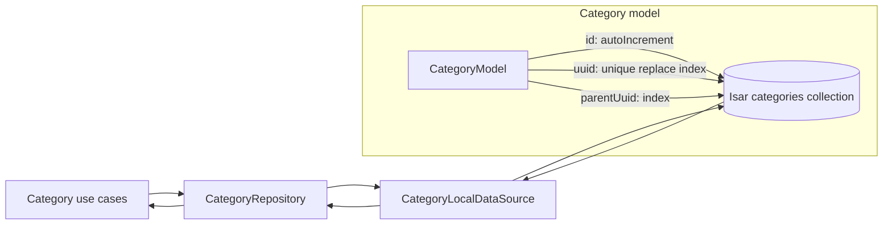

# Summary

Create the Domain and Data layers for hierarchical categories so the feature has a sync-friendly, local-first persistence model before any presentation work starts. The plan keeps the hierarchy contract explicit: UUID-first identity, nullable parent UUID for children, local Isar as the source of truth, and transactional subtree handling when a parent is removed.

# Problem Frame

The repository currently has only the template `counter` feature. The category feature is still missing its domain model, repository contract, Isar schema, and local repository implementation, even though the product scope already calls for hierarchical categories in settings and sync-friendly offline storage.

# Requirements Traceability

- `documents/sdd.md` defines the feature module `feat-expense-category`.
- Parent categories must have a unique `uuid` and no `parentUuid`.
- Child categories must point at a valid parent via `parentUuid`.
- Deleting a parent must cascade or safely handle descendants.
- Sync metadata is required from the start: `isSynced` and `updatedAt`.
- `README.md` frames the product as local-first, clean architecture, and Isar-backed sync with Firebase backup.

# High-Level Technical Design

The design keeps the hierarchy flat in storage: `parentUuid` is a persisted field, not an Isar link. That matches the sync contract and makes subtree lookups and parent validation explicit in the repository layer.

# Scope Boundaries

## In scope

- Domain entity and repository contract for hierarchical categories.
- Domain use cases for reading, saving, and deleting categories.
- Isar collection schema and repository mapping for root and child categories.
- Local data source and repository implementation with transactional subtree delete behavior.
- Dependency injection for the Isar instance and category repository.
- Tests for domain validation, schema mapping, and repository behavior.

## Deferred to Follow-Up Work

- Presentation widgets, routing, and category management screens.
- Firestore sync implementation and auth-driven user partitioning.
- Transaction feature integration beyond preserving category subtree integrity.

# Key Technical Decisions

1. **Single collection, nullable hierarchy field.** Use one `CategoryModel` collection with `parentUuid: String?` instead of separate parent/child collections.
2. **Local surrogate id, external UUID identity.** Let Isar manage `Id id = Isar.autoIncrement` locally, while `uuid` remains the sync-facing identifier and unique key.
3. **Unique replace index on `uuid`.** This supports deterministic upserts from local or remote sources without duplicating category rows.
4. **Indexed `parentUuid`.** Subtree queries and parent existence checks will rely on the parent index instead of Isar links.
5. **Repository owns hierarchy integrity.** The repository will validate parent existence on save and will delete descendants in a single write transaction when a parent is removed.

# Implementation Units

### U1. Defining category domain primitives and contracts

**Goal:** Add the domain entity, repository contract, and use cases needed to manipulate hierarchical categories without any UI concerns.

**Files:** `lib/features/category/domain/entities/category.dart`, `lib/features/category/domain/repositories/category_repository.dart`, `lib/features/category/domain/usecases/watch_categories_usecase.dart`, `lib/features/category/domain/usecases/save_category_usecase.dart`, `lib/features/category/domain/usecases/delete_category_usecase.dart`, `lib/features/category/category.dart`, `test/features/category/domain/entities/category_test.dart`, `test/features/category/domain/usecases/watch_categories_usecase_test.dart`, `test/features/category/domain/usecases/save_category_usecase_test.dart`, `test/features/category/domain/usecases/delete_category_usecase_test.dart`

**Approach:** Model category identity with the existing `UniqueId` value object, keep `parentUuid` nullable for roots, and expose repository methods that can support both root-category reads and subtree mutations. Keep the contract focused on local-first behavior so later presentation code can build on streams rather than ad hoc fetches.

**Patterns to follow:** `lib/core/domain/usecases/use_case.dart`, `lib/shared/domain/entities/value_objects.dart`, `lib/features/counter/counter.dart`

**Test scenarios:**
- Root categories can be represented with a valid UUID and no parent UUID.
- Child categories can be represented with a valid parent UUID.
- Invalid UUID or empty name inputs fail at the value-object boundary.
- Use cases delegate to the repository and preserve failure values unchanged.
- Repository contract shape covers read, save, and delete operations for a hierarchy.

**Verification:** The domain layer can express the hierarchy and sync metadata without any Isar-specific details leaking into the entity.

### U2. Mapping categories to an Isar collection

**Goal:** Add the persistence model and Isar bootstrap needed to store categories locally with sync-safe identity and indexed hierarchy lookups.

**Files:** `pubspec.yaml`, `build.yaml`, `lib/core/di/isar_module.dart`, `lib/features/category/data/models/category_model.dart`, `test/features/category/data/models/category_model_test.dart`

**Approach:** Add the Isar packages and generator wiring, then define a single `CategoryModel` collection with an auto-increment `Id`, unique-replace `uuid`, nullable indexed `parentUuid`, `isSynced`, and `updatedAt`. Keep the model mapping explicit so the local surrogate key stays internal while the UUID remains the domain-facing identifier.

**Patterns to follow:** `analysis_options.yaml` exclusions for generated code, `lib/core/di/storage_module.dart`, current `injectable` bootstrap patterns

**Test scenarios:**
- A root category record persists with `parentUuid == null`.
- A child category record persists with the expected parent UUID.
- Duplicate UUID inserts replace the existing row instead of creating a second one.
- Parent UUID queries can fetch only direct children.
- The collection schema includes the expected indexed fields and generated accessor.

**Verification:** The Isar schema can round-trip a category subtree shape and preserve UUID-based identity across inserts and updates.

### U3. Implementing the local category repository

**Goal:** Add the local data source and repository implementation that enforce hierarchy rules, persist categories, and remove descendant rows safely.

**Files:** `lib/features/category/data/datasources/category_local_data_source.dart`, `lib/features/category/data/repositories/category_repository_impl.dart`, `lib/injector.dart`, `lib/injector.config.dart`, `test/features/category/data/datasources/category_local_data_source_test.dart`, `test/features/category/data/repositories/category_repository_impl_test.dart`

**Approach:** Make the repository the enforcement point for parent existence checks and subtree deletion. Reads should come from the local data source as streams so the app can react to the database immediately; writes should run inside a single transaction so parent removal never leaves dangling descendants.

**Patterns to follow:** `lib/shared/flash/presentation/blocs/cubit/flash_cubit.dart` for injectable style, `lib/core/storages/local_storages.dart` for storage abstraction shape, `test/helpers/configure_injector.dart`

**Test scenarios:**
- Saving a root category succeeds and is visible in later reads.
- Saving a child with an existing parent succeeds and preserves the parent UUID.
- Saving a child with a missing parent returns a local failure.
- Deleting a parent removes the full descendant subtree in one transaction.
- Stream reads update after save and delete operations without manual refresh.

**Verification:** A fresh app instance can create, read, update, and delete hierarchical categories locally without violating the parent-child contract.

# Risks & Dependencies

- Isar is not used anywhere else in the repo yet, so dependency wiring and generated-code setup need to be correct on the first pass.
- Parent deletion semantics can ripple into the future transaction feature; the repository must stay strict about subtree integrity so later category references do not become ambiguous.
- The plan assumes one local category collection is enough for the current SDD contract; splitting parent and child storage would complicate sync matching without adding value.

# Sources & Research

- `README.md`
- `documents/sdd.md`
- Isar schema, indexes, and links docs at `https://isar.dev/schema.html`, `https://isar.dev/indexes.html`, and `https://isar.dev/links.html`
- Repo research agent findings on current architecture and conventions
