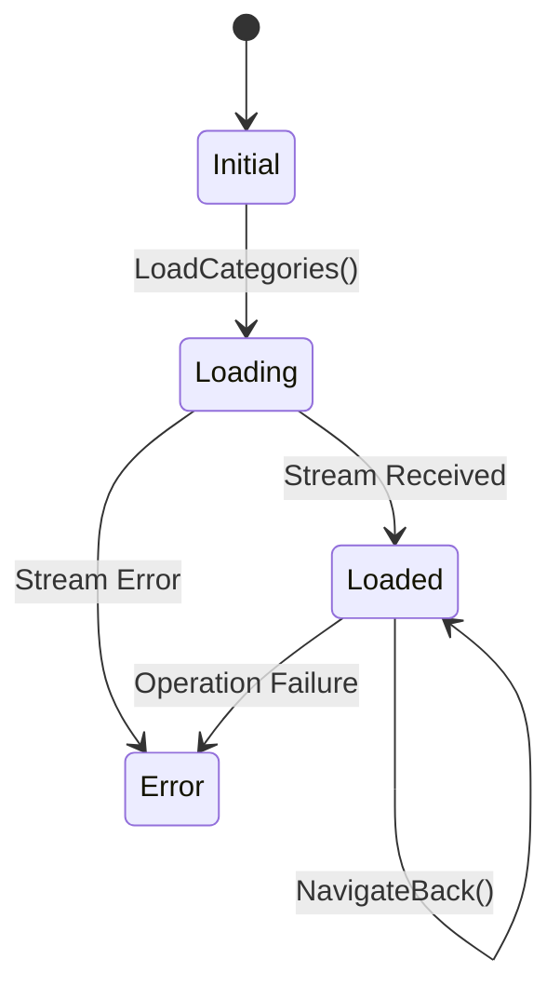

# Summary

Implement the Presentation Layer for hierarchical expense categories using Flutter BLoC (Cubit). This unit enables users to traverse the category hierarchy, create root or child categories, and manage subtrees with reactive UI updates driven by the local Isar database.

# Problem Frame

With the Domain and Data layers complete (Units 1-3), the application needs a user-facing interface to manage categories. The UI must support "drilling down" from root categories to subcategories while maintaining a consistent state and reacting instantly to database changes (e.g., cascade deletions).

# Requirements Traceability

- `documents/sdd.md` specifies `flutter_bloc` for state management and reactive UI updates from database streams.
- **Hierarchical Navigation**: Support traversal from parent categories to their direct children.
- **Creation Validation**: Validate category names and ensure parent references are valid during creation.
- **Reactive Subtree Management**: UI must reflect cascade deletions (purging a parent removes all children) automatically via the repository stream.
- **Cubit Pattern**: Align with the project's use of `injectable` and Cubit for state management.

# High-Level Technical Design

### Category State Tree

The `CategoryCubit` will manage a state that tracks both the data and the user's current position in the hierarchy.



### State Model Composition

```dart
class CategoryState {
  final List<Category> allCategories; // Full stream from repo
  final List<String> navigationStack; // Stack of parentUuids for "back" navigation
  final bool isLoading;
  final String? error;

  // Derived: categories to show in current view
  List<Category> get currentViewCategories => allCategories.where(
    (c) => c.parentUuid?.getOrCrash() == activeParentUuid
  ).toList();

  String? get activeParentUuid => navigationStack.isEmpty ? null : navigationStack.last;
}
```

# Scope Boundaries

## In scope

- `CategoryCubit` and `CategoryState` for hierarchical management.
- Traversal UI components (List, List Item, Manage Page).
- Category creation/edit form with parent selection support.
- Navigation logic (drill-down and breadcrumb/back-stack).
- Reactive UI response to cascade deletions.

## Deferred to Follow-Up Work

- Visual styling and animations for traversal.
- Drag-and-drop hierarchy reorganization.
- Search/Filter across the entire hierarchy (global search).

# Key Technical Decisions

1.  **Single Stream, Local Filtering**: The Cubit will subscribe to the global `watchCategories` stream once. Filtering for the current level (parent/child) will happen in the `Loaded` state using the `navigationStack`. This ensures the UI is always in sync with the database without multiple subscription overhead.
2.  **Navigation Stack in State**: Use a `List<String> navigationStack` to keep track of the hierarchy depth. This allows for easy "Back" navigation and breadcrumb implementation without complex router logic.
3.  **Shared Form for Root and Children**: Use a single `CategoryFormPage` that adapts based on whether an `activeParentUuid` is provided, pre-filling the parent category if navigating from a child view.
4.  **Implicit Cascade UI**: Because the `CategoryRepository` handles cascade deletions transactionally, the UI will simply react to the shrinking `allCategories` list in the stream. No explicit UI "purge" logic is needed beyond the initial delete call.

# Implementation Units

### U4.1. Category Cubit and State implementation

**Goal:** Create the reactive state management core for categories.

**Files:** `lib/features/category/presentation/blocs/category_cubit.dart`, `lib/features/category/presentation/blocs/category_state.dart`, `test/features/category/presentation/blocs/category_cubit_test.dart`

**Approach:** Implement `CategoryCubit` using the `WatchCategoriesUseCase`. The state must carry the `navigationStack` to support hierarchy traversal. Methods should include `selectCategory(uuid)`, `goBack()`, `saveCategory(category)`, and `deleteCategory(uuid)`.

**Patterns to follow:** `lib/features/counter/presentation/blocs/counter_cubit.dart`, `lib/shared/flash/presentation/blocs/cubit/flash_cubit.dart`

**Test scenarios:**
- Cubit emits `Loading` then `Loaded` when stream starts.
- `selectCategory` adds a UUID to the `navigationStack`.
- `goBack` removes the last UUID from the stack.
- `deleteCategory` delegates to the use case and handles errors via `FlashCubit` or local state.
- UI reacts when the underlying category list in `allCategories` changes (including children disappearing on parent delete).

**Verification:** Unit tests confirm state transitions and traversal logic work without a UI.

### U4.2. Category List and Item widgets

**Goal:** Build the reusable UI components for displaying categories.

**Files:** `lib/features/category/presentation/widgets/category_list_item.dart`, `lib/features/category/presentation/widgets/category_list.dart`

**Approach:** `CategoryListItem` should display the category name and an "arrow" icon if it has children (or as a general "drill-down" affordance). `CategoryList` takes a list of categories and handles empty states.

**Patterns to follow:** Existing list patterns in the template (if any, otherwise standard Flutter `ListView`).

**Test scenarios:**
- List displays categories for the current level.
- Tapping an item triggers `selectCategory` in the Cubit.
- Swiping or long-pressing (depending on UX choice) triggers delete confirmation.

**Verification:** Widget tests confirm correct data rendering and interaction bubbling.

### U4.3. Category Management Page

**Goal:** Implement the main screen for traversing and managing the hierarchy.

**Files:** `lib/features/category/presentation/pages/category_manage_page.dart`

**Approach:** A `Scaffold` with a `BlocBuilder` for the `CategoryCubit`. Use `PopScope` (or `WillPopScope`) to intercept the system back button and trigger `goBack()` in the Cubit if the `navigationStack` is not empty. It should show a breadcrumb or a title that changes based on the `activeParentUuid`. Includes a FAB (Floating Action Button) to add a new category at the current level.

**Patterns to follow:** `lib/app/view/app.dart` for routing/scaffold patterns.

**Test scenarios:**
- Page shows "Root Categories" when the stack is empty.
- Page shows the parent category name when drilled down.
- FAB opens the creation form.
- Back button (system or UI) triggers `goBack()` if the stack is not empty.
- System back button closes the page if the stack is empty.

**Verification:** Integration test confirms navigation from Root to Child and back.

### U4.4. Category Creation and Edit Form

**Goal:** Provide a validated interface for adding and editing categories.

**Files:** `lib/features/category/presentation/pages/category_form_page.dart`

**Approach:** A simple form with a `TextFormField` for the name and a read-only or dropdown field for the `Parent Category`. If the user is already in a subcategory view, the parent is pre-selected and locked. Use `Formz` or standard `GlobalKey<FormState>` for validation. Surname uniqueness check (if implemented in domain) should be handled via the result of the `SaveCategoryUseCase`.

**Patterns to follow:** `lib/core/extensions/context_extensions.dart` for theme/spacing access.

**Test scenarios:**
- Name field validates "not empty" and "single line".
- Parent category is correctly assigned for subcategories.
- Saving a valid category calls the Cubit and closes the page.
- Errors from the repository (e.g., missing parent) are displayed to the user.

**Verification:** Manual or widget test confirms category can be created and appears in the list.

# Risks & Dependencies

- **Navigation Conflict**: Ensure the `navigationStack` in the Cubit doesn't conflict with the app's global router (`go_router`). The Cubit manages *internal* hierarchy state, while the router handles *page* state.
- **Stream Performance**: With many categories, the derived `currentViewCategories` getter in the state should be efficient. Isar's stream is generally fast, but we should monitor for UI lag.

# Sources & Research

- `documents/sdd.md`
- `docs/plans/2026-06-03-001-feat-hierarchical-category-domain-data-plan.md`
- Flutter BLoC Documentation: `https://bloclibrary.dev/`
- Isar Watch Documentation: `https://isar.dev/queries.html#watching-queries`
