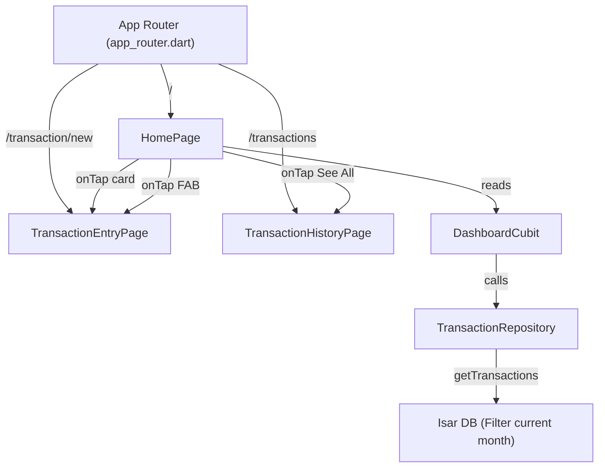

# feat: Implement Main Dashboard Screen

## Summary
Architectural design and implementation blueprint for introducing the Main Dashboard (Home Screen) layout and state management. This covers refactoring the existing `_TransactionCard` into a shared widget, introducing `DashboardCubit` for current-month aggregation, building the `HomePage` with summary statistics and quick-action navigation, and restructuring app router paths.

---

## Problem Frame
Users need a central dashboard showing their overall financial standing (balance, income, expenses) for the current calendar month, along with quick access to their recent transaction history and a fast route to add new entries. Currently, the app defaults directly to the transaction entry page, lacking a central overview hub.

---

## Requirements

### R1. Reusable Card Extraction
- R1.1. Extract the private `_TransactionCard` widget from [transaction_history_page.dart](file:///home/mfrozi/Code/Mobile/flutter/expense-tracker/lib/features/transaction/presentation/pages/transaction_history_page.dart) into a public, standalone `TransactionCard` widget at [transaction_card.dart](file:///home/mfrozi/Code/Mobile/flutter/expense-tracker/lib/features/transaction/presentation/widgets/transaction_card.dart).
- R1.2. Re-import and integrate the extracted `TransactionCard` back into [transaction_history_page.dart](file:///home/mfrozi/Code/Mobile/flutter/expense-tracker/lib/features/transaction/presentation/pages/transaction_history_page.dart).

### R2. State Management (`DashboardCubit`)
- R2.1. Define `DashboardState` containing:
  - `isLoading` (bool)
  - `totalBalance` (double)
  - `totalIncome` (double)
  - `totalExpense` (double)
  - `recentTransactions` (List<Transaction>)
  - `failureOption` (Option<Failure>)
- R2.2. Implement `DashboardCubit` with a `loadDashboardData()` method.
- R2.3. Fetch transactions starting from the first day of the current calendar month up to the current day using `TransactionRepository.getTransactions`.
- R2.4. Aggregate metrics dynamically:
  - `totalIncome` = Sum of all `TransactionType.income` entries.
  - `totalExpense` = Sum of all `TransactionType.expense` entries.
  - `totalBalance` = `totalIncome - totalExpense`.
- R2.5. Slice and extract the first 5 entries from the retrieved list (representing the most recent transactions sorted by date descending) to populate `recentTransactions`.

### R3. UI & Layout
- R3.1. Create a `SummaryCard` widget rendering total balance, income, and expenses with high contrast, legible typography, and currency formatting.
- R3.2. Create `HomePage` widget presenting:
  - Welcome greeting section.
  - `SummaryCard` metric totals.
  - "Recent Transactions" header with a "See All" button that routes to `/transactions`.
  - ListView of up to 5 `TransactionCard` items.
  - Floating Action Button (FAB) styled premiumly that routes to `/transaction/new`.

### R4. Routing & Dependency Injection
- R4.1. Register `DashboardCubit` as an `@injectable` component in dependency injection.
- R4.2. Update [app_router.dart](file:///home/mfrozi/Code/Mobile/flutter/expense-tracker/lib/app/router/app_router.dart):
  - Change the root route `/` to mount `HomePage` inside a `BlocProvider<DashboardCubit>`.
  - Register `/transaction/new` to mount `TransactionEntryPage` inside a `BlocProvider<TransactionCubit>`.
  - Update `TransactionCard`'s tap handler to navigate to `/transaction/new` with the transaction object payload (for editing).

---

## Key Technical Decisions

- **KTD1. Shared Widget Extraction**: Extract `_TransactionCard` into a public, standalone class `TransactionCard` in [transaction_card.dart](file:///home/mfrozi/Code/Mobile/flutter/expense-tracker/lib/features/transaction/presentation/widgets/transaction_card.dart).
  - *Rationale*: Reuses the list item layout across both the ledger history and dashboard screens to avoid code duplication and keep styles in sync.
- **KTD2. Calendar Month Boundaries**: Dynamically calculate the beginning of the calendar month (e.g. `DateTime(now.year, now.month, 1)`) inside `DashboardCubit` to filter transactions.
  - *Rationale*: Directly addresses the user request to align dashboard statistics with monthly budget boundaries.
- **KTD3. Entry Page Path Relocation**: Shift the default root `/` view to the new `HomePage` and bind the `TransactionEntryPage` to `/transaction/new`.
  - *Rationale*: Frees up `/` to act as the primary dashboard while preserving entry and edit workflows.

---

## High-Level Technical Design

---

## Implementation Units

### U1. Reusable TransactionCard Extraction
- **Goal**: Move `_TransactionCard` from history page to a separate widgets folder and fix the tap path to route to `/transaction/new` instead of `/transactions`.
- **Files**:
  - `lib/features/transaction/presentation/widgets/transaction_card.dart`
  - `lib/features/transaction/presentation/pages/transaction_history_page.dart`
- **Approach**:
  - Create the new file and migrate `_TransactionCard`, its variables, and the helper helpers `_getCategoryIcon` and `_getCategoryColor` into it.
  - Rename to `TransactionCard`.
  - In `onTap`, replace `context.push('/transactions', extra: transaction)` with `context.push('/transaction/new', extra: transaction)`.
  - Update `transaction_history_page.dart` to import the new `TransactionCard` and remove the private class definition.
- **Test Scenarios**:
  - Check that building the codebase compiles successfully.
  - Verify that the card displays correctly on the history page and that tapping opens the editing view.

### U2. Dashboard Cubit and State Management
- **Goal**: Build state definitions and BLoC Cubit computing the summary figures for the current calendar month.
- **Files**:
  - `lib/features/dashboard/presentation/blocs/dashboard_state.dart`
  - `lib/features/dashboard/presentation/blocs/dashboard_cubit.dart`
  - `test/features/dashboard/presentation/blocs/dashboard_cubit_test.dart`
- **Approach**:
  - Create state properties (`isLoading`, `totalBalance`, `totalIncome`, `totalExpense`, `recentTransactions`, `failureOption`).
  - Implement `DashboardCubit` inheriting `Cubit<DashboardState>`.
  - Inject `TransactionRepository`.
  - In `loadDashboardData()`, get current local time. Set `startDate = DateTime(now.year, now.month, 1)`. Set `endDate = DateTime(now.year, now.month, now.day, 23, 59, 59)`.
  - Call `repository.getTransactions(startDate: startDate, endDate: endDate)`.
  - Map success entries to state aggregates (sum income vs expense) and slice first 5 for `recentTransactions`.
  - Implement `test/features/dashboard/presentation/blocs/dashboard_cubit_test.dart` using mock repository, validating correct calculations and date window filtering.
- **Test Scenarios**:
  - Mock repository returning specific lists of transactions. Verify that income, expense, and balances match expected mathematical answers.
  - Verify slice limits the transaction count to a maximum of 5 items.

### U3. Dashboard UI (HomePage and SummaryCard)
- **Goal**: Develop the visual presentation layer for the dashboard.
- **Files**:
  - `lib/features/dashboard/presentation/widgets/summary_card.dart`
  - `lib/features/dashboard/presentation/pages/home_page.dart`
- **Approach**:
  - Create `SummaryCard` with custom container boxes, formatting monetary items as currency.
  - Create `HomePage` using `BlocBuilder` for `DashboardCubit`. On init, dispatch `loadDashboardData()`.
  - Render summary card at the top, followed by recent transaction list using `TransactionCard`.
  - Wire the FloatingActionButton to route to `/transaction/new` and the "See All" button to `/transactions`.
- **Test Scenarios**:
  - Check UI builds without overflow or rendering bugs.
  - Verify click handlers invoke correct routing methods.

### U4. Dependency Injection & Routing Configuration
- **Goal**: Re-wire route endpoints in the app and regenerate injectable configurations.
- **Files**:
  - `lib/app/router/app_router.dart`
  - `lib/injector.config.dart`
- **Approach**:
  - Annotate `DashboardCubit` with `@injectable`.
  - In `app_router.dart`, reassign path `/` to construct `HomePage` with `DashboardCubit` provider.
  - Assign path `/transaction/new` to construct `TransactionEntryPage` with `TransactionCubit` provider.
  - Run code generation via `make build` to populate injection config.
- **Test Scenarios**:
  - Ensure all tests in `test/` (including newly created ones) compile and run via `fvm flutter test`.
  - Verify app launches and routes properly between pages.
