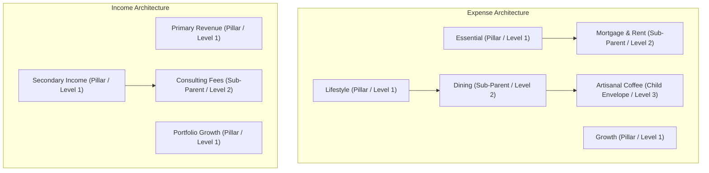
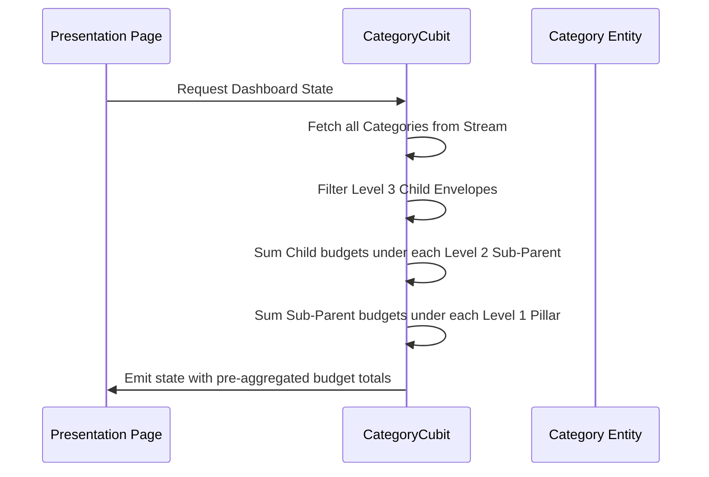

# feat: Financial Architecture (Category Overhaul)

## Summary
Outline the technical changes, testing scenarios, and migration pathways needed to transition the existing Category system to a hierarchical Envelope & Pillar system. This plan details domain modifications, state management additions, standalone widget implementation, and page-level integration.

---

## Problem Frame
The current ledger system manages flat, unstructured categories. To enable sophisticated cashflow forecasting and behavioral modeling, the system must support a strict three-level hierarchy (Primary Pillar > Sub-Parent > Child Envelope), baseline budget inputs, and behavioral tags (Active, Passive, Recurring). We are renaming the user-facing nomenclature from "Categories" to "Envelopes" and "Category Groupings" to "Pillars".

---

## Requirements

### Domain & Terminology Shift
- R1. Terminology Update: Map user-visible strings to refer to Categories as "Envelopes" and Groupings as "Pillars".
- R2. Hierarchical Validation: Enforce a strict three-level taxonomy: Primary Pillar (Level 1, e.g. Lifestyle) > Sub-Parent (Level 2, e.g. Dining) > Child Envelope (Level 3, e.g. Artisanal Coffee).
- R3. Data Additions: Envelopes must support an Expected Monthly Budget/Amount (numeric baseline) and a Behavioral Modifier tag (Active, Passive, Recurring).

### UI Component & Form Page
- R4. Form Segmented Control: Provide a segmented toggle for choosing "Expense" vs. "Income" nature.
- R5. Visual Breadcrumbs: Show a breadcrumb path tracking the active nesting level (`Primary Pillar > Sub-Parent > Child Envelope`).
- R6. Envelope Type Selector: Show large interactive cards for selecting Level 1 Pillars (Essential, Lifestyle, Growth for Expense; Primary Revenue, Secondary Income, Portfolio Growth for Income).
- R7. Budget Input: Implement a centered numerical input field with large typography to log expected baseline budget.
- R8. Modifier Toggles: Implement three horizontal pill-shaped toggle buttons for selecting Active, Passive, or Recurring modifiers.
- R9. Hierarchy Insight Card: Render a bottom summary card displaying how the Envelope will be nested and its relative budget impact.

### Dashboard & Nested List View
- R10. Portfolio Distribution Card: Build a premium dark-blue header card showing the total allocated budget across envelopes, with a multi-color progress bar showing percentage breakdown between Essential, Lifestyle, and Growth.
- R11. Collapsible Envelope Tree: Display Envelopes in an expandable/collapsible tree structure with trailing budget allocations.

---

## Key Technical Decisions

- KTD1. Single-Table Database Hierarchy: Represent the three-level hierarchy within a single Isar `CategoryModel` using a nullable `parentId` field (renamed/replaced from `parentUuid`). Root Pillars have `parentId == null`. Sub-parents have `parentId` pointing to a Pillar. Child Envelopes have `parentId` pointing to a Sub-parent. This keeps the schema unified and leverages existing recursive delete logic.
- KTD2. Explicit Nature Type: Add a `CategoryType` enum (`expense`, `income`) to both `Category` and `CategoryModel` to support queries and filters on the dashboard and form pages without traversing root parents.
- KTD3. Dynamic Budget Aggregation: Total allocated budgets for Pillars and Sub-parents are calculated dynamically at the Presentation/Cubit layer by aggregating child envelope budget amounts. This ensures a single source of truth for budget amounts and prevents sync errors in the database.
- KTD4. Seed default Pillars: Automate seeding of the 6 fixed Level 1 Pillars during repository initialization if the database is empty.
  - Expense Pillars: Essential, Lifestyle, Growth
  - Income Pillars: Primary Revenue, Secondary Income, Portfolio Growth
- KTD5. Enforce Hierarchy in Domain: Add validation inside `SaveCategoryUseCase` or the `Category` entity constructor to prevent invalid nesting structures (e.g. child envelopes pointing directly to root pillars or nesting beyond 3 levels).

---

## High-Level Technical Design

### Hierarchy Structure

### Budget Aggregation Sequence

---

## Implementation Units

### U1. Update Domain Layer (Enums & Entity)
- **Goal:** Update the core Domain models and validations to support the new terminology, fields, and hierarchy rules.
- **Files:**
  - `lib/features/category/domain/entities/category.dart`
- **Approach:**
  - Define `BehavioralModifier` enum with values `active`, `passive`, `recurring`.
  - Define `CategoryType` enum with values `expense`, `income`.
  - Replace `parentUuid` with `parentId` (type `UniqueId?`).
  - Add fields `expectedMonthlyBudget` (type `double`) and `behavioralModifier` (type `BehavioralModifier`).
  - Add `CategoryType type` field.
  - Implement validation methods on `Category` entity: `bool isValidHierarchy(List<Category> allCategories)` which verifies that Level 3 has a Level 2 parent, and Level 2 has a Level 1 parent.
- **Test Scenarios:**
  - `test/features/category/domain/entities/category_test.dart`:
    - Verify entity instantiation with new fields.
    - Test validation logic for invalid hierarchy depth (e.g. nesting a child directly under a Pillar, or adding a Level 4 category).

### U2. Update Data Layer (Isar Schema & Mapping)
- **Goal:** Migrate `CategoryModel` database schema and repositories to handle new fields and Isar indexing.
- **Files:**
  - `lib/features/category/data/models/category_model.dart`
  - `lib/features/category/data/repositories/category_repository_impl.dart`
  - `lib/features/category/data/datasources/category_local_data_source.dart`
- **Approach:**
  - Update `CategoryModel` class:
    - Replace `parentUuid` with `parentId` index.
    - Add `@enumerated` `CategoryType type`.
    - Add `late double expectedMonthlyBudget`.
    - Add `@enumerated` `BehavioralModifier behavioralModifier`.
  - Update `fromEntity` and `toEntity` mapper methods.
  - Update `CategoryLocalDataSource` search queries to filter by `parentId` instead of `parentUuid`.
  - Regenerate Isar adapter via `flutter pub run build_runner build --delete-conflicting-outputs`.
- **Test Scenarios:**
  - `test/features/category/data/models/category_model_test.dart`:
    - Test mapping to and from the updated domain entity.
  - `test/features/category/data/repositories/category_repository_impl_test.dart`:
    - Validate hierarchy checks in repository implementation during save operation.

### U3. Pillars Auto-Seeding
- **Goal:** Seed the default Level 1 Pillars during data source init so users always have root category pillars.
- **Files:**
  - `lib/features/category/data/datasources/category_local_data_source.dart`
- **Approach:**
  - In `IsarCategoryLocalDataSource` constructor or open stream trigger, check if `categoryModels` table is empty.
  - If empty, write default root pillar categories (Essential, Lifestyle, Growth as `CategoryType.expense`, and Primary Revenue, Secondary Income, Portfolio Growth as `CategoryType.income`) with `parentId = null`.
- **Test Scenarios:**
  - Add integration-level test to confirm database auto-seeding when no records are present in local storage.

### U4. State Management (CategoryCubit & State)
- **Goal:** Update the Cubit state and business logic to support segmented filters, navigation stack, and budget sums.
- **Files:**
  - `lib/features/category/presentation/blocs/category_cubit.dart`
  - `lib/features/category/presentation/blocs/category_state.dart`
- **Approach:**
  - In `CategoryState`, add `selectedType` field (defaulting to `CategoryType.expense`).
  - Add getters to `CategoryState`:
    - `List<Category> get activePillars` -> Returns root categories matching the selected type.
    - `Map<String, double> get pillarBudgets` -> Maps parent category UUIDs to the aggregated sum of child expected monthly budgets.
    - `double get totalBudget` -> Sum of all envelope budgets of the active type.
  - Update `CategoryCubit` to support:
    - `void setCategoryType(CategoryType type)` to switch active nature.
    - `void selectParent(String? parentId)` to drill down navigation hierarchy.
- **Test Scenarios:**
  - Create `test/features/category/presentation/blocs/category_cubit_test.dart`:
    - Test toggle type updates state.
    - Test calculations for dynamic budget aggregation under parent pillars.

### U5. Reusable Presentation Widgets
- **Goal:** Implement the new user interface widgets according to the design HTML mockup styling.
- **Files:**
  - `lib/features/category/presentation/widgets/portfolio_distribution_card.dart`
  - `lib/features/category/presentation/widgets/hierarchy_insight_card.dart`
  - `lib/features/category/presentation/widgets/envelope_creation_form.dart`
  - `lib/features/category/presentation/widgets/envelope_tree_list_view.dart`
- **Approach:**
  - `PortfolioDistributionCard`: Dark blue card container matching the gradient, display total allocated budget, progress bar showing proportional width segments for Essential, Lifestyle, and Growth.
  - `HierarchyInsightCard`: Inline bottom card showing where the new envelope resides in the hierarchy (Pillar > Sub-Parent) and its percentage of the total budget.
  - `EnvelopeCreationForm`: Input components for name, budget input (large centered text), modifier toggles (horizontal pills: Active/Passive/Recurring), and pillar picker.
  - `EnvelopeTreeListView`: Expandable parent list view using indentation guidelines (`stagger-line` classes from HTML mockup).

### U6. Page-Level Integration
- **Goal:** Embed the presentation components into the page templates and connect state actions to Cubit functions.
- **Files:**
  - `lib/features/category/presentation/pages/category_form_page.dart`
  - `lib/features/category/presentation/pages/category_manage_page.dart`
- **Approach:**
  - Replace form layout in `category_form_page.dart` with `EnvelopeCreationForm` and wire to `CategoryCubit.saveCategory`.
  - Replace scroll view contents in `category_manage_page.dart` to show the updated `PortfolioDistributionCard` and the `EnvelopeTreeListView`. Connect list expand toggles to Cubit events.

---

## Verification & Test Scenarios

### Dynamic UI Interaction
- Confirm segmented toggle on Form switches Level 1 Pillar options instantly.
- Verify Hierarchy Insight card dynamically re-renders when changing parent categories or expected amounts.
- Verify progress bar segments on Portfolio Distribution Card adjust proportionally based on Category amounts.

### Hierarchy Constraints
- Verify saving an envelope without a parent category throws a validation error (unless it is a Pillar).
- Verify database cascade deletion correctly removes child envelopes when their sub-parent is deleted.
- Verify duplicate name prevention under the same parent node in the hierarchy.
