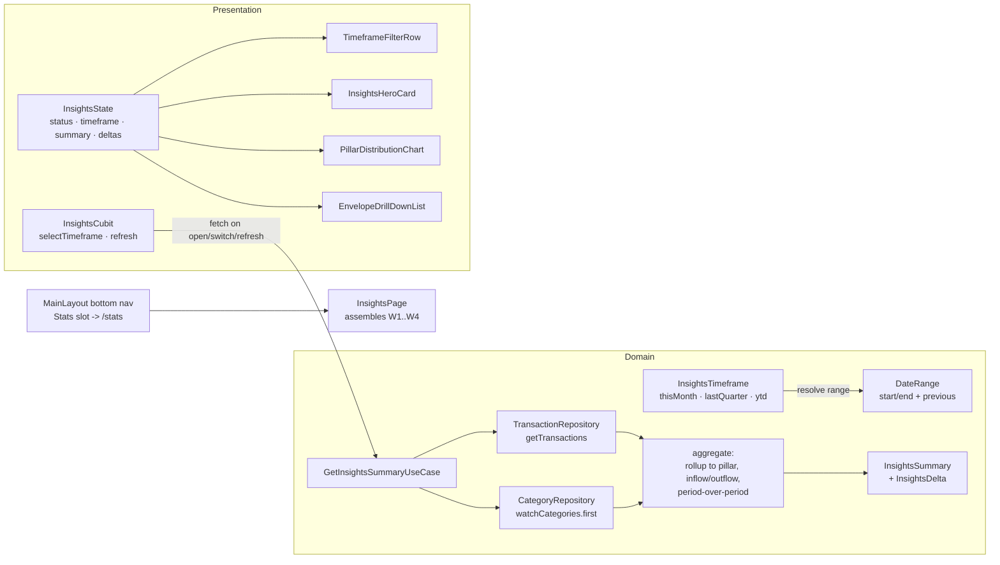

# feat: Insights & Analytics

## Problem Frame

The app records transactions against a 3-level envelope hierarchy
(Pillar → Sub-Parent → Envelope) but offers no way to *see* where money
went. The Stats tab is a "Coming Soon" placeholder. Users need a single
insights screen that answers: how much flowed in/out this period, how
does that compare to the previous period, and which pillars/envelopes
drove it — filterable by **This Month**, **Last Quarter**, and **YTD**.

**Type:** `feat` · **Depth:** Standard

## Scope

**In scope**
- Timeframe filtering (This Month / Last Quarter / YTD) with
  period-over-period deltas
- Aggregation of transaction amounts from Level-3 envelopes up to
  Level-1 pillars, rendered as nested distribution UI
- Inflow = `income` + `investment` transactions; outflow = `expense`
  (user-confirmed)
- Replacing the Coming Soon **Stats** tab with Insights (same nav slot,
  route stays `/stats`) (user-confirmed)
- On-demand fetch (open, timeframe switch, pull-to-refresh) following
  the DashboardCubit pattern (user-confirmed)
- Financial Atelier styling: `#00113A → #002366` gradient hero, Manrope
  headlines, Inter body (per `docs/solutions/tooling-decisions/ui-design-system.md`)

**Out of scope (deferred)**
- Currency customization — amounts stay IDR via `NumberFormat.currency`,
  matching `SummaryCard` (roadmap Phase 3)
- Wealth trajectory / net-worth chart on the dashboard (static placeholder
  stays untouched)
- Trend sparklines over time buckets, custom date ranges, CSV export
- Firestore sync dependencies (roadmap Phase 4)

## Requirements

- **R1** — Insights data is filtered by a selectable timeframe: This
  Month (1st of current month → end of month), Last Quarter (previous
  calendar quarter), YTD (Jan 1 → today).
- **R2** — Transaction amounts aggregate from the transaction's direct
  category up to its Level-1 pillar via the cycle-safe
  `Category.getRootPillar`; envelope rows attribute to the transaction's
  direct category.
- **R3** — The screen shows total outflow (expense) and total inflow
  (income + investment) for the selected timeframe.
- **R4** — Outflow and inflow show a delta vs the equivalent previous
  window (prior month / prior quarter / same span last year); zero
  previous totals show "new" instead of a percentage.
- **R5** — A multi-segment progress bar shows each pillar's share of
  outflow; a drill-down list shows each envelope with breadcrumb, share
  of pillar, and amount.
- **R6** — Switching timeframe recalculates without leaving the page;
  pull-to-refresh re-fetches; empty periods render a dedicated empty
  state.

## High-Level Technical Design



Aggregation lives in the domain layer (one usecase, pure functions over
fetched lists — no Isar aggregation queries needed at current data
volume); the cubit stays a thin fetch/state holder like `DashboardCubit`.

## Output Structure

```
lib/features/insights/
├── domain/
│   ├── entities/
│   │   ├── insight_timeframe.dart      # enum + date-range resolution
│   │   └── insights_summary.dart       # summary, pillar & envelope rows, delta
│   └── usecases/
│       └── get_insights_summary_usecase.dart
├── presentation/
│   ├── pages/
│   │   └── insights_page.dart
│   ├── blocs/
│   │   ├── insights_cubit.dart
│   │   └── insights_state.dart
│   └── widgets/
│       ├── timeframe_filter_row.dart
│       ├── insights_hero_card.dart
│       ├── pillar_distribution_chart.dart
│       └── envelope_drill_down_list.dart
test/features/insights/
├── domain/usecases/get_insights_summary_usecase_test.dart
├── presentation/blocs/insights_cubit_test.dart
└── presentation/widgets/insights_widgets_test.dart
```

---

## Phase 1 — Domain Layer (Aggregation)

### U1. Insights domain entities and GetInsightsSummaryUseCase

**Goal:** Resolve a timeframe into a date range and current/previous
window, fetch both windows' transactions plus the category list, and
return an `InsightsSummary` with pillar rollups, inflow/outflow, and
deltas.

**Requirements:** R1, R2, R3, R4
**Dependencies:** none (builds on existing `TransactionRepository` and
`CategoryRepository`)
**Files:**
- `lib/features/insights/domain/entities/insight_timeframe.dart` (new)
- `lib/features/insights/domain/entities/insights_summary.dart` (new)
- `lib/features/insights/domain/usecases/get_insights_summary_usecase.dart` (new)
- `test/features/insights/domain/usecases/get_insights_summary_usecase_test.dart` (new)

**Approach:**
- `InsightsTimeframe { thisMonth, lastQuarter, ytd }` with a
  `resolve(DateTime now)` returning the primary `DateRange` and its
  `previous` comparable range (month → prior month; quarter → prior
  calendar quarter; YTD → Jan 1 of *previous* year → same offset).
- `GetInsightsSummaryUseCase(params {timeframe, now})` (a `StreamUseCase`
  is unnecessary — one-shot like `GetTransactionsUseCase`):
  1. Resolve both ranges.
  2. `getTransactions(startDate:, endDate:)` for current and previous
     ranges (existing repository filters, inclusive end-of-day).
  3. `categoryRepository.watchCategories().first` for the category map
     (uuid → Category); resolve failures to `Left(Failure.localFailure)`.
  4. Roll each transaction to its pillar via `getRootPillar(allCategories)`;
     transactions whose category is missing from the map are grouped under
     an "Uncategorized" bucket, never dropped.
  5. Build `InsightsSummary`: `totalOutflow` (expense sum),
     `totalInflow` (income + investment sums), `PillarInsight` list
     (pillar, outflow, inflow, `shareOfOutflow`, ordered desc) each
     carrying `EnvelopeInsight` rows (category, amount, `shareOfPillar`,
     transaction count), plus `InsightsDelta` for outflow/inflow:
     `((current - previous) / previous * 100)` with an `isNew` flag when
     `previous == 0`.
- Keep the summary classes `Equatable` (state-management house style).

**Patterns to follow:** `GetTransactionsUseCase` (one-shot usecase shape),
`Category.getRootPillar` (cycle-safe walk, capped by the 3-level model),
`CategoryTreeX` extension conventions in
`lib/features/category/domain/extensions/category_tree.dart`.

**Test scenarios:**
- This Month resolves to 1st-of-month 00:00 → last instant of the month;
  YTD resolves to Jan 1 → today end-of-day. (R1)
- Last Quarter resolves Q(n-1) boundaries regardless of today's date.
- Transactions outside the range are excluded; boundary-day transactions
  (last day of month, Dec 31) are included. (R1)
- Pillar rollup: transactions under L2 and L3 categories roll up to the
  same pillar; pillar total equals sum of its envelope rows. (R2)
- Transaction with a category missing from the list lands in the
  "Uncategorized" bucket, not dropped. (R2 edge)
- Outflow excludes income/investment; inflow sums income + investment.
  (R3 — covers the user's investment decision)
- Delta: current 300 vs previous 200 → +50%; previous 0 → `isNew` with no
  percentage; current 0 vs previous 200 → −100%. (R4)
- Empty both windows → zeroed summary, no exceptions. (edge)
- Repository failure surfaces as `Left(Failure)`. (error path)

**Verification:** usecase tests green; summary values hand-checkable from
fixture transactions; `fvm flutter analyze --no-pub` clean.

---

## Phase 2 — State Management

### U2. InsightsCubit and InsightsState

**Goal:** Own the selected timeframe, expose a loading/loaded/failure
state machine, recompute on timeframe switch, and support pull-to-refresh.

**Requirements:** R1, R3, R4, R5 (state carries the nested maps)
**Dependencies:** U1
**Files:**
- `lib/features/insights/presentation/blocs/insights_cubit.dart` (new)
- `lib/features/insights/presentation/blocs/insights_state.dart` (new)
- `test/features/insights/presentation/blocs/insights_cubit_test.dart` (new)

**Approach:**
- `InsightsState`: `selectedTimeframe` (default `thisMonth`), `status`
  (`initial/loading/loaded/failure`), `summary` (`InsightsSummary?`),
  `failureOption` — mirroring `DashboardState`'s option-based failure.
- `InsightsCubit(loadInsightsSummary, {required DateTime Function()? nowProvider})`:
  `load(timeframe)` emits loading → summary/failure; `selectTimeframe(t)`
  reloads with the new timeframe; `refresh()` reloads the current one.
  A fixed `nowProvider` keeps timeframe resolution deterministic in tests.
- Registered `@injectable`; the page provides it via
  `BlocProvider(create: getIt<InsightsCubit>())` like the router does for
  `DashboardCubit`.

**Patterns to follow:** `DashboardCubit`/`DashboardState`
(`lib/features/dashboard/presentation/blocs/`) — one-shot fetch, option
failure, no stream subscriptions (user-confirmed on-demand model).

**Test scenarios:**
- Initial state is `initial` + `thisMonth` with no summary. (happy)
- `load` emits loading then a populated summary for mock usecase output.
  (happy)
- `selectTimeframe(lastQuarter)` triggers a second usecase call with the
  quarter params. (happy — R1)
- Usecase failure → `failure` status with `failureOption` populated; UI
  contract test reads it. (error path)
- Two rapid timeframe switches resolve to the last requested timeframe
  (last-write-wins accepted; document if a guard is added). (edge)

**Verification:** cubit tests green; no additional DI registration churn
(`@injectable` auto-registers; `injector.config.dart` is regenerated by
`build_runner`).

---

## Phase 3 — Presentation Widgets (Atelier Design)

### U3. Insights widgets: TimeframeFilterRow, InsightsHeroCard, PillarDistributionChart, EnvelopeDrillDownList

**Goal:** Stateless widgets consuming `InsightsState`/`InsightsSummary`
with the Financial Atelier visual language.

**Requirements:** R3, R4, R5 (presentation half of R1)
**Dependencies:** U1 (entities), U2 (state to render)
**Files:**
- `lib/features/insights/presentation/widgets/timeframe_filter_row.dart` (new)
- `lib/features/insights/presentation/widgets/insights_hero_card.dart` (new)
- `lib/features/insights/presentation/widgets/pillar_distribution_chart.dart` (new)
- `lib/features/insights/presentation/widgets/envelope_drill_down_list.dart` (new)
- `test/features/insights/presentation/widgets/insights_widgets_test.dart` (new)

**Approach:**
- **TimeframeFilterRow** — capsule segmented control (stadium container,
  `#F3F4F5` track, active segment filled with the primary gradient,
  Manrope 14 w700 labels; inactive `Inter` w500 `#444650`). Same toggle
  anatomy as `EnvelopeCreationForm._buildNatureToggle`
  (`lib/features/category/presentation/widgets/envelope_creation_form.dart`).
  Callback `onTimeframeChanged(InsightsTimeframe)`.
- **InsightsHeroCard** — full-width gradient capsule
  (`LinearGradient(colors: [Color(0xFF00113A), Color(0xFF002366)])`),
  Manrope w800 white totals; outflow/inflow rows with delta chips
  (▲ green `#3CD150` / ▼ red `#FF6B6B` on alpha containers, matching
  `SummaryCard` accents); `isNew` renders a neutral chip instead of a
  percentage (R4). Inter 12 for labels.
- **PillarDistributionChart** — multi-segment horizontal progress bar:
  `Row` of `Expanded(flex: outflowShare)` segments in per-pillar accent
  colors from the design system (green `#A0F399` / rose `#FFDAD6` /
  primary-container `#D6E3FF`, mirroring
  `PortfolioDistributionCard`'s pillar color mapping), legend rows with
  pillar name + formatted amount + share %, `Inter` 12 labels.
  Pillars sorted by outflow descending; zero-outflow pillars collapse to
  the legend with a zero-width bar. **No new chart dependency** —
  mirrors `PortfolioDistributionCard`'s hand-built approach.
- **EnvelopeDrillDownList** — for each pillar section: header
  (Manrope 13 w800 `#00113A`) then envelope rows (icon avatar, name,
  `Inter` 11 breadcrumb via `Category.getBreadcrumbPath`, share bar,
  `Inter` 12 amount) — row anatomy borrowed from
  `HierarchicalEnvelopePickerSheet._buildEnvelopeRow`. Tapping an
  envelope row is out of scope (deferred).
- All widgets stateless, fed plain data (never `BuildContent` the cubit —
  the page binds state to widgets, keeping widgets preview-friendly).

**Patterns to follow:** `SummaryCard` (gradient + typography),
`PortfolioDistributionCard` (distribution bar + pillar colors),
`EnvelopeTreeListView` (row anatomy + icon helpers).

**Test scenarios:**
- Filter row shows the three labels; tapping "Last Quarter" fires
  `onTimeframeChanged(lastQuarter)`. (happy — R1)
- Hero renders formatted outflow/inflow and delta chip for a fixture
  summary; `isNew` delta shows the neutral chip (no percentage). (happy —
  R3/R4)
- Chart segments flex-share proportions for two pillars (e.g. 70/30) and
  hide segments for zero-share pillars. (edge — R5)
- Drill-down renders breadcrumb path and per-envelope amounts for a
  nested fixture; empty pillar sections are omitted. (happy + edge — R2)
- Empty-summary state renders the hero with zeroed values and no list
  rows. (edge)

---

## Phase 4 — Integration

### U4. Insights page assembly, router and bottom-nav activation

**Goal:** Assemble the page, replace the Stats placeholder, and activate
the nav slot.

**Requirements:** R1–R5 (integration half)
**Dependencies:** U1, U2, U3
**Files:**
- `lib/features/insights/presentation/pages/insights_page.dart` (new)
- `lib/app/router/app_router.dart` (modify — `/stats` builder)
- `lib/app/view/main_layout.dart` (modify — label/icon)
- `test/features/insights/presentation/pages/insights_page_test.dart` (new)

**Approach:**
- **InsightsPage** — `BlocProvider(create: getIt<InsightsCubit>()..load())`,
  `Scaffold` surface `#F8F9FA`, `BlocConsumer` with
  `FailureMessageHandler` for failures (house pattern from
  `lib/core/presentation/mixins/failure_message_handler.dart`), body:
  `TimeframeFilterRow`, `InsightsHeroCard`,
  `PillarDistributionChart`, `EnvelopeDrillDownList` inside a
  `RefreshIndicator` + `SingleChildScrollView` (pull-to-refresh →
  `refresh()`, matching `HomePage`).
- **Router** — keep the path `/stats` (route stays stable; user-confirmed
  slot swap) and swap the placeholder Scaffold for `InsightsPage`.
- **MainLayout** — nav label "Stats" → "Insights"; icon
  `Icons.bar_chart` → `Icons.donut_small`; `_getCurrentIndex` keeps
  matching on `/stats` so highlighting is unchanged.
- Provide `InsightsCubit` through the page builder with `getIt` (same
  pattern as `HomePage`'s `DashboardCubit`), NOT at app root — the page
  refetches on every mount, keeping the on-demand model honest.

**Test scenarios:**
- Page loads: shows hero + filter row + (with fixture data) pillar
  segments; tapping "Last Quarter" triggers a refetch (state transitions
  loading → loaded). Covers R1. (happy)
- Failure state renders the failure message via the flash/snackbar
  pattern. (error path)
- Router integration: `pumpAppRouter('/stats')` renders InsightsPage
  (title visible) and the bottom nav marks index 2 active. (integration —
  R6)
- Nav rename: MainLayout shows the "Insights" label for the third item.
  (integration)

**Verification:** manual on-device pass — switch timeframes, pull to
refresh, confirm deltas and drill-down against seeded transactions;
`very_good test --optimization` passes in merged mode (single-process
GetIt — configure via `configureInjector` only if DI is needed in tests;
cubit/widget tests use direct construction like `transaction_card_test.dart`).

---

## Risks

- **Currency hardcoding** — amounts are IDR-formatted inline
  (`NumberFormat.currency(symbol: 'IDR ')`), matching `SummaryCard`;
  Phase 3 currency customization will need a shared formatter extraction.
  Accepted for now; noted in Deferred.
- **`TransactionType.investment` vs `CategoryType` mismatch** — there is
  no investment `CategoryType`; investment transactions attach to
  expense/income categories. Aggregation treats *amounts* by
  `TransactionType`, never by category type, so the mismatch is inert —
  documented here so implementers don't "fix" it.
- **Large YTD windows** — `getTransactions` loads the full range into
  memory; fine at current scale (local Isar, personal volume). If it ever
  grows, move aggregation into an Isar query or aggregate incrementally —
  deferred.
- **Empty previous period** — delta math must not divide by zero; the
  `isNew` flag is the contract (covered in U1 tests).

## Deferred to Follow-Up Work

- Wiring `WealthTrajectoryChart` to real data (static placeholder today).
- Trend breakdowns per pillar (line/bar over weeks) — natural Phase 2
  follow-up once the summary domain objects exist.
- Currency formatter extraction to shared utils (Phase 3 roadmap item).
- Export/share of the insights view (roadmap Phase 3 data export).

## Verification (whole feature)

1. `fvm flutter analyze --no-pub` — clean.
2. `fvm flutter test` — all suites green (usecase, cubit, widgets, page).
3. `very_good test --optimization --coverage --min-coverage 0
   --report-on lib --show-uncovered` (CI-equivalent) — exit 0.
4. `fvm dart format --output=none --set-exit-if-changed lib test` — clean.
5. On device: Insights tab opens with This Month default, toggles
   timeframes, deltas render, pull-to-refresh works, and transaction
   creation updates the numbers on next pull-to-refresh.
