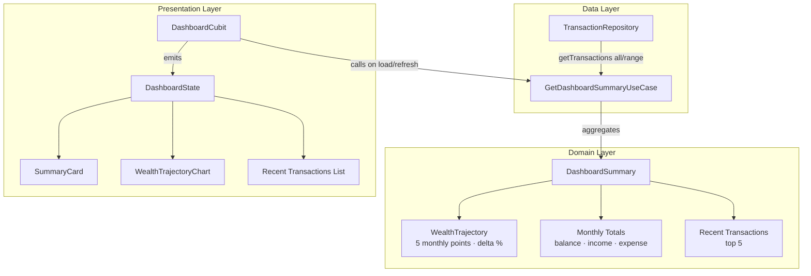

# feat: Dashboard Dynamic Wealth Trajectory

## Summary

Wires the Dashboard's `WealthTrajectoryChart` to real historical transaction data across a rolling 5-month window (M-4 through current month M). Replaces hardcoded mock bars and static copy with dynamic net worth progression, month labels, and month-over-month growth calculations.

---

## Problem Frame

The home dashboard is the primary landing screen of the app. Currently:
1. `WealthTrajectoryChart` renders hardcoded mock bars (`40, 60, 50, 80, 110`) and a static string `"Your net worth increased by 8.2% this month."` regardless of user activity.
2. `DashboardCubit` only fetches the current calendar month's transactions, leaving it unable to provide historical trajectory data without refactoring.

Users need an accurate visual pulse of their net worth trajectory across the last 5 months, showing how their savings and cumulative balance have grown or shifted month over month.

**Type:** `feat` · **Depth:** Standard

---

## Scope

### In Scope
- **Dynamic Wealth Trajectory**:
  - Historical 5-month rolling window (M-4 through current month M).
  - Cumulative net worth / balance standing at the end of each month.
  - Normalized bar heights with current month highlighted in primary navy (`#00113A`).
  - Month name labels beneath each bar (`Inter` 11 `#757682`).
  - Month-over-month growth rate percentage and dynamic headline copy ("Your net worth increased by X% this month.", "decreased by X%", "steady", or first-month message).
- **Domain Aggregation**:
  - Dedicated `GetDashboardSummaryUseCase` following the clean architecture pattern established by `GetInsightsSummaryUseCase`.
  - Deterministic `nowProvider` for reliable time-based testing.
- **State Management & UI Integration**:
  - `DashboardCubit` and `DashboardState` updated to carry trajectory data.
  - On-demand fetch on page mount and on pull-to-refresh.

### Out of Scope (Deferred to Follow-Up Work)
- **Daily Logging Streak System**: Gamified streak tracker deferred to a dedicated retention iteration.
- Push notifications / daily reminders.
- Cloud backup & Firebase sync of trajectory data (roadmap Phase 4).
- Currency customization (amounts remain IDR until shared currency utility is extracted).

---

## Requirements

- **R1 (Trajectory Calculation)**: The system computes cumulative net worth (total income minus total expense up to that point) for the end of each of the past 5 calendar months, plus month-over-month growth percentage between the current month and the previous month.
- **R2 (Trajectory UI)**: `WealthTrajectoryChart` renders proportional vertical bars for each of the 5 months with month labels below each bar, visually highlights the current month, and displays dynamic copy reflecting the month-over-month change.
- **R3 (Architecture & Testability)**: Aggregation logic resides in the domain layer (`GetDashboardSummaryUseCase`), keeping `DashboardCubit` thin. A deterministic `nowProvider` ensures all date calculations are 100% reproducible in tests.
- **R4 (Dashboard Integration)**: `HomePage` passes real trajectory data from `DashboardState` into `WealthTrajectoryChart` and updates on pull-to-refresh.

---

## Key Technical Decisions

- **KTD-1: Cumulative Running Balance for Trajectory Bars**:
  - *Decision*: Trajectory bars represent cumulative total balance (net worth) at the end of each month rather than isolated monthly cash flow.
  - *Rationale*: Matches the label "Wealth Trajectory" and user expectation of net worth progression. Monthly cash flow is already visualized in the Insights tab.
- **KTD-2: Clean Architecture UseCase Extraction**:
  - *Decision*: Introduce `GetDashboardSummaryUseCase` instead of putting multi-month aggregation logic directly into `DashboardCubit`.
  - *Rationale*: Matches the successful pattern in `GetInsightsSummaryUseCase` (from Insights & Analytics), allowing pure-function unit testing without widget or cubit plumbing.
- **KTD-3: Proportion-Clamped Bar Sizing**:
  - *Decision*: Bar heights scale proportionally against the maximum net worth in the 5-month window up to 100dp, with a minimum floor (e.g. 8dp) for zero or baseline points.
  - *Rationale*: Prevents bars from disappearing or overflowing if a month has zero balance or if earlier balances are small.

---

## High-Level Technical Design



---

## Output Structure

```
lib/features/dashboard/
├── domain/
│   ├── entities/
│   │   ├── wealth_trajectory.dart
│   │   └── dashboard_summary.dart
│   └── usecases/
│       └── get_dashboard_summary_usecase.dart
├── presentation/
│   ├── blocs/
│   │   ├── dashboard_cubit.dart
│   │   └── dashboard_state.dart
│   ├── pages/
│   │   └── home_page.dart
│   └── widgets/
│       ├── summary_card.dart
│       ├── wealth_trajectory_chart.dart
│       └── record_entry_card.dart
test/features/dashboard/
├── domain/
│   └── usecases/
│       └── get_dashboard_summary_usecase_test.dart
└── presentation/
    ├── blocs/
    │   └── dashboard_cubit_test.dart
    ├── pages/
    │   └── home_page_test.dart
    └── widgets/
        └── wealth_trajectory_chart_test.dart
```

---

## Implementation Units

### U1. Dashboard Domain Layer (`WealthTrajectory`, `GetDashboardSummaryUseCase`)

**Goal:** Create domain entities and a central usecase that loads transactions and computes current month balance, 5-month wealth trajectory, and recent transactions.

**Requirements:** R1, R3
**Dependencies:** None (builds on existing `TransactionRepository`)
**Files:**
- `lib/features/dashboard/domain/entities/wealth_trajectory.dart` (new)
- `lib/features/dashboard/domain/entities/dashboard_summary.dart` (new)
- `lib/features/dashboard/domain/usecases/get_dashboard_summary_usecase.dart` (new)
- `test/features/dashboard/domain/usecases/get_dashboard_summary_usecase_test.dart` (new)

**Approach:**
- `WealthTrajectory`: `List<TrajectoryPoint>` containing 5 points (for months M-4, M-3, M-2, M-1, M).
  - Each point: `month` (DateTime), `netWorth` (cumulative balance through the end of that month), `isCurrentMonth` (bool).
  - `growthPercentage`: `((currentNetWorth - prevNetWorth) / prevNetWorth.abs()) * 100`, null if previous is zero.
  - `headlineDescription`: Formatted message (e.g. "Your net worth increased by 8.2% this month.", "Your net worth decreased by 3.5% this month.", "First month of tracking.", or "Steady this month.").
- `GetDashboardSummaryUseCase`:
  - Accepts optional `DateTime Function()? nowProvider`.
  - Fetches all transactions up to current date (or all transactions).
  - Aggregates current month balance (income, expense, balance).
  - Slices top 5 recent transactions.
  - Returns `Right(DashboardSummary)` or `Left(Failure)`.

**Patterns to follow:** `GetInsightsSummaryUseCase` (`lib/features/insights/domain/usecases/get_insights_summary_usecase.dart`).

**Test scenarios:**
- Trajectory: Returns exactly 5 monthly points ordered chronologically ending in current month. (happy)
- Trajectory: Net worth increases from 1000 to 1200 -> growthPercentage is +20.0%, description says increased by 20.0%. (happy)
- Trajectory: Net worth drops from 1000 to 800 -> growthPercentage is -20.0%, description says decreased by 20.0%. (happy)
- Trajectory: Previous month net worth 0, current month > 0 -> handles division by zero safely. (edge)
- Trajectory: No transactions exist -> 5 zeroed points with neutral message. (edge)
- Summary: Current month totals and top 5 recent transactions match fixture data. (happy)
- Failure: Repository failure surfaces as `Left(Failure)`. (error path)

**Verification:** `fvm flutter test test/features/dashboard/domain/usecases/get_dashboard_summary_usecase_test.dart` passes.

---

### U2. Dashboard State & Cubit (`DashboardCubit`, `DashboardState`)

**Goal:** Refactor `DashboardCubit` and `DashboardState` to use `GetDashboardSummaryUseCase` and expose the rich dashboard summary.

**Requirements:** R1, R3
**Dependencies:** U1
**Files:**
- `lib/features/dashboard/presentation/blocs/dashboard_state.dart` (modify)
- `lib/features/dashboard/presentation/blocs/dashboard_cubit.dart` (modify)
- `test/features/dashboard/presentation/blocs/dashboard_cubit_test.dart` (modify)

**Approach:**
- Extend `DashboardState`:
  - Add `wealthTrajectory` (`WealthTrajectory?`).
  - Maintain existing `isLoading`, `totalBalance`, `totalIncome`, `totalExpense`, `recentTransactions`, `failureOption` for backwards compatibility.
- Update `DashboardCubit`:
  - Inject `GetDashboardSummaryUseCase` (instead of raw repository).
  - Add `nowProvider` parameter for testing.
  - On `loadDashboardData()`, emit loading, execute usecase, update state with summary data or failure.

**Patterns to follow:** `InsightsCubit` (`lib/features/insights/presentation/blocs/insights_cubit.dart`).

**Test scenarios:**
- Initial state has null trajectory and `isLoading: true`. (happy)
- Successful load populates balance, trajectory, and recent transactions. (happy)
- Failure emits `isLoading: false` with `failureOption`. (error path)
- Pull-to-refresh / multiple reloads re-execute usecase properly. (happy)

**Verification:** `fvm flutter test test/features/dashboard/presentation/blocs/dashboard_cubit_test.dart` passes.

---

### U3. Dynamic `WealthTrajectoryChart` Widget Refactor

**Goal:** Transform `WealthTrajectoryChart` from a static mock widget into a dynamic, data-driven visualization consuming `WealthTrajectory`.

**Requirements:** R2
**Dependencies:** U1
**Files:**
- `lib/features/dashboard/presentation/widgets/wealth_trajectory_chart.dart` (modify)
- `test/features/dashboard/presentation/widgets/wealth_trajectory_chart_test.dart` (new)

**Approach:**
- `WealthTrajectoryChart({super.key, required this.trajectory})`.
- Layout:
  - Header: "Wealth Trajectory" (Manrope 18 w700 `#00113A`).
  - Subtitle: `trajectory.headlineDescription` (Inter 14 `#757682`).
  - Bar area: 5 vertical bars:
    - Scale bar height proportionally from 0 to max net worth in the 5 points (maximum bar height ~100dp).
    - Provide a minimum height floor (e.g. 8dp) for zero or baseline points so bars remain visible structure.
    - Current month highlighted in deep navy (`#00113A`) with elevation shadow; past months in light gray (`#E5E7EB`).
    - Below each bar, render the 3-letter month abbreviation (e.g. "May", "Jun", "Jul", "Aug", "Sep") using `Inter` 11 `#757682`.
- Gracefully handles empty or all-zero data.

**Patterns to follow:** `PortfolioDistributionCard` (`lib/features/category/presentation/widgets/portfolio_distribution_card.dart`) and `PillarDistributionChart` (`lib/features/insights/presentation/widgets/pillar_distribution_chart.dart`).

**Test scenarios:**
- Renders headline, dynamic growth subtitle, and 5 month labels. (happy)
- Highlights the current month bar with `#00113A` and other bars with `#E5E7EB`. (happy)
- Handles all-zero net worth trajectory with min-height bars without crashing. (edge)
- Accurately scales bar height relative to maximum net worth. (happy)

**Verification:** `fvm flutter test test/features/dashboard/presentation/widgets/wealth_trajectory_chart_test.dart` passes.

---

### U4. Dashboard Assembly & Integration on `HomePage`

**Goal:** Wire `WealthTrajectoryChart` with `state.wealthTrajectory` in `HomePage`, handling loading/empty states and refresh flows.

**Requirements:** R2, R4
**Dependencies:** U2, U3
**Files:**
- `lib/features/dashboard/presentation/pages/home_page.dart` (modify)
- `test/features/dashboard/presentation/pages/home_page_test.dart` (new)

**Approach:**
- In `HomePage`:
  - Pass `state.wealthTrajectory` into `WealthTrajectoryChart`.
  - Show placeholder or fallback when trajectory is loading/empty.
  - Verify pull-to-refresh triggers cubit refresh.

**Test scenarios:**
- HomePage renders WealthTrajectoryChart with dynamic cubit state. (integration)
- Pull-to-refresh triggers cubit reload and re-renders chart. (integration)

**Verification:** `fvm flutter test test/features/dashboard/presentation/pages/home_page_test.dart` passes.

---

## Risks

- **All-Time Transaction Scan**:
  - *Risk*: Calculating 5-month trajectory requires scanning historical transactions.
  - *Mitigation*: Isar local queries on indexed `date` are sub-millisecond at personal finance scale (<10,000 transactions).
- **Negative Net Worth**:
  - *Risk*: Cumulative expenses exceeding income could produce negative net worth in earlier months.
  - *Mitigation*: Bar height scaling clamps negative values to a minimum height baseline to avoid negative layout overflow.

---

## Deferred to Follow-Up Work

- Daily Logging Streak system (gamification retention feature).
- Push notifications for daily activity reminders.
- Firestore sync of trajectory history (Phase 4).
- Shared currency preferences across dashboard widgets (Phase 3 currency extraction).

---

## Verification (Whole Feature)

1. `fvm flutter analyze --no-pub lib test` — exit 0, no analyzer warnings or errors.
2. `fvm flutter test --no-pub --coverage` — all unit, cubit, widget, and page test suites green.
3. Manual verification:
   - Dashboard loads with real 5-month trajectory bars and month labels.
   - Adding or editing transactions updates the trajectory bars and growth copy on next refresh.
