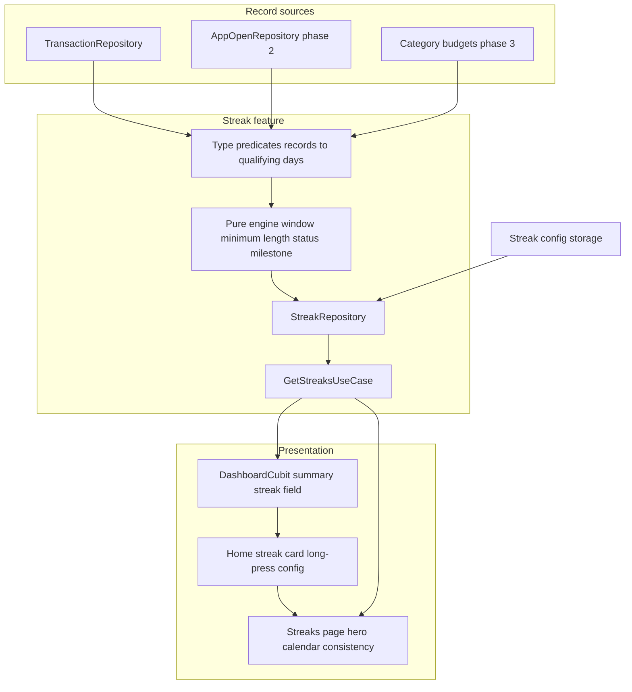
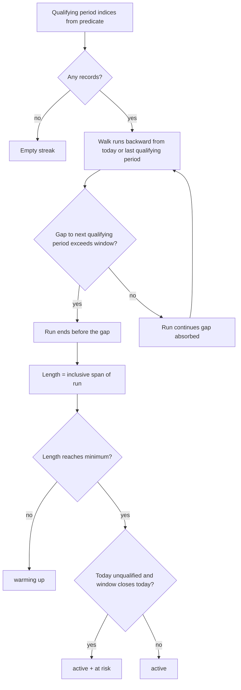

# feat: Streak System

## Summary

Build a multi-type streak system on one generic qualifying-run engine: tracking streak (phase 1) with hidden config and home flame card, no-spend and app-open consistency streaks (phase 2), and an under-budget monthly streak (phase 3). All streak values derive from records at read time — nothing about a streak is persisted.

## Problem Frame

The origin document frames the problem: expense logging is bursty, so a strict daily streak punishes good behavior (no-spend days) and trains fake logging. The design (`documents/stitch-export.html`) presents streaks as achievements — a home flame card and a full streaks page (hero counter, month calendar, consistency rate, milestones). To be honest achievements, the mechanic must forgive short lapses (window), only celebrate real habits (minimum), and never store a streak state that can diverge from the ledger. (see origin: docs/brainstorms/2026-09-25-streak-system-requirements.md)

## Requirements

Carried from the origin document — IDs match 1:1 (see origin for full prose and acceptance examples).

**Streak engine**

- R1. Streak length counts calendar days covered by the run, first to last qualifying day inclusive.
- R2. Gaps between consecutive qualifying days up to the type's window (default 3) do not break the run.
- R3. All run math uses local calendar dates, never raw timestamps.
- R4. Each run carries a status: warming up below minimum, active at or above it, at risk when the window is about to close.
- R5. Celebration only at or above the minimum (default 3); below it the UI frames warming up.
- R6. Every streak type is defined solely by a qualifying rule over records; one engine computes all types identically.
- R7. Streak values always recompute from records; backdated records can extend or heal runs retroactively.

**Configuration**

- R8. One hidden config surface: long-press any streak element opens a single sheet at that type's section.
- R9. Settings cover tracking window and minimum and per-type cadence; defaults 3 / 3 / 7.
- R10. App-open cadence accepts presets 1, 2, 3 plus custom; cadence 1 means qualifying every day.

**Streak types**

- R11. Tracking streak (phase 1): a day qualifies when at least one transaction is recorded against it.
- R12. No-spend streak (phase 2): a day qualifies when no expenses are recorded against it.
- R13. App-open consistency streak (phase 2): qualifying opens spaced within cadence N keep the run.
- R14. Under-budget streak (phase 3): monthly; a completed month qualifies when total expenses are within total expected budgets; the in-progress month shows an on/off-track preview and never changes the count.

**Presentation**

- R15. Home shows a compact streak card: flame, "N Day Streak", at-risk / next-milestone subtitle, progress toward next milestone.
- R16. Streaks page shows per type: hero counter, month calendar of qualifying days, consistency rate for the month.
- R17. Months qualifying on totals while individual categories exceeded their budgets are flagged without affecting the streak.
- R18. Streaks update reactively as records change, including backdated changes.
- R19. Milestones display upcoming thresholds; they do not persist unlock state.

## Key Technical Decisions

- **Derived-only computation.** No streak table, no stored counters. `StreakRepository` recomputes on demand from records; dashboard reactivity rides the existing `watchTransactions` subscription (`lib/features/dashboard/presentation/blocs/dashboard_cubit.dart` `_init`). Rationale: honest recompute per origin R7, zero reconciliation logic.
- **One pure engine, period-abstract from day one.** A single function over an ordered sequence of period indices (day or month), a window, and a minimum produces length, status, days-until-break, next milestone. Monthly support is built in up front because phase 3 needs it; retrofitting a days-only engine would be a rewrite. Engine lives in `lib/features/streak/domain/` as a pure class — no I/O, trivially unit-testable.
- **Types are predicates, not subclasses of logic.** Each `StreakType` maps to a predicate that turns records into a set of qualifying period indices; the engine is identical for all types. App-open cadence reuses the window mechanism — cadence N *is* the window for that type (cadence 1 collapses to a daily streak, origin AE5).
- **App-open events get their own Isar collection.** First record class not derived from transactions. `AppOpenModel` with a date index, written once at app bootstrap. Isar over shared_preferences because the streaks page needs the full open history for calendar and consistency rendering.
- **Config persists via existing `LocalStorage`** (`lib/core/storages/local_storages.dart`): new keys for window, minimum, and cadence with defaults 3 / 3 / 7. No migration needed — unset keys fall back to defaults.
- **Pinned defaults from the deferred origin questions:** shared milestone ladder 7 / 14 / 21 / 30 / 60 / 90 / 180 / 365 days; at-risk = today unqualified and today is the last day the window still covers (window closes tomorrow); consistency rate = qualifying periods ÷ elapsed periods in the current calendar month (per period type). All three are constants in the domain layer, tunable later without rework.
- **Budget aggregation reuses existing category helpers.** `CategoryState.pillarBudgets` / `totalBudget` (`lib/features/category/presentation/blocs/category_state.dart`) show the summing pattern for leaf-level `expectedMonthlyBudget`; the under-budget qualifier sums leaf budgets across expense categories and compares against the month's expense total.

## High-Level Technical Design

Data flow — record sources feed predicates, one engine, two presentation surfaces:

Engine decision flow per run computation (status semantics pinned in KTDs; state machine in origin):

## Implementation Units

Phases mirror the origin document. Units are dependency-ordered; each is one landable commit.

### U1. Streak domain core — entities and pure engine

- **Goal:** The complete streak math, testable in isolation.
- **Requirements:** R1, R2, R3, R4, R5, R6 (engine portion)
- **Dependencies:** none
- **Files:** `lib/features/streak/domain/entities/streak.dart` (entity: type, length, status, daysUntilBreak, nextMilestone, consistencyRate), `lib/features/streak/domain/entities/streak_status.dart`, `lib/features/streak/domain/entities/streak_type.dart`, `lib/features/streak/domain/entities/streak_config.dart`, `lib/features/streak/domain/entities/streak_period.dart` (day/month abstraction), `lib/features/streak/domain/services/streak_engine.dart`, tests in `test/features/streak/domain/services/streak_engine_test.dart` and `test/features/streak/domain/entities/`
- **Approach:** Engine takes an ordered set/list of qualifying period indices (as `DateTime` dates for days, year-month pairs for months), a `StreakConfig` (window, minimum), and "today" as explicit input for testability. Returns the current run plus the best historical run (cheap byproduct, useful later). Milestone ladder and status rules live as domain constants per KTD. Follow the pure-helper precedent of `lib/features/transaction/presentation/utils/expression_evaluator.dart`; entity style follows existing `Equatable` entities.
- **Test scenarios:**
  - Happy path: consecutive daily logs produce length equal to day span; minimum met → active.
  - Covers AE1. Window absorbs a 2-day gap at window 3; status at risk when today unqualified on the window's last covered day.
  - Covers AE2. Gap exceeding window ends the run; next qualifying day starts a fresh run; best-run retains the old run.
  - Covers AE3. Length below minimum reports warming up, never active.
  - Empty record set → empty streak, no crash.
  - Today qualified → never at risk regardless of older gaps.
  - Month-period run: consecutive qualifying months, gap absorption across year boundary (Dec → Jan).
  - DST / timezone safety: dates passed through local-date stripping; no UTC arithmetic shifts the day bucket.
- **Verification:** `fvm flutter test test/features/streak` green; engine has zero Flutter imports.

### U2. Streak config storage

- **Goal:** Window, minimum, and cadence persist with defaults.
- **Requirements:** R9, R10 (persistence portion)
- **Dependencies:** none
- **Files:** `lib/core/storages/local_storages.dart` (extend abstract + impl), test in `test/core/storages/local_storages_test.dart`
- **Approach:** New typed accessors on the existing `LocalStorage` abstraction (pattern-matching `getApiKey`/`setApiKey`); keys `streakWindowDays`, `streakMinimumDays`, `appOpenCadenceDays`. Getters return defaults 3 / 3 / 7 when unset. Values clamped to sane bounds at read time (window ≥ 1, minimum ≥ 1).
- **Test scenarios:**
  - Unset keys return defaults 3 / 3 / 7.
  - Round-trip set/get for each key.
  - Out-of-range stored value (0 or negative) clamps on read.
- **Verification:** storage tests green; no Isar codegen involved.

### U3. Streak repository and use case (tracking predicate)

- **Goal:** Tracking streak derived from transactions, exposed through the standard use-case seam.
- **Requirements:** R6, R7, R9, R11
- **Dependencies:** U1, U2
- **Files:** `lib/features/streak/domain/repositories/streak_repository.dart`, `lib/features/streak/data/repositories/streak_repository_impl.dart`, `lib/features/streak/domain/usecases/get_streaks_use_case.dart`, tests in `test/features/streak/data/repositories/streak_repository_impl_test.dart`
- **Approach:** Impl injects `TransactionRepository` and `LocalStorage`. Fetches transactions via `getTransactions` (date-indexed; ranged query from run horizon — bounded lookback by longest plausible window, e.g. 2 years) and applies the tracking predicate: any transaction date → qualifying day. Config comes from U2 storage. Returns `Either<Failure, Streak>` per `UseCase` conventions (`lib/core/domain/usecases/use_case.dart`).
- **Test scenarios:**
  - Transactions on scattered days within window → single run, calendar-span length.
  - Two clusters separated by more than window → current run is the recent one; best run is the longer cluster.
  - Config override: window 1 behaves as strict daily streak.
  - Repository failure from `TransactionRepository` propagates as `Left`.
  - No transactions at all → empty streak entity.
- **Verification:** repository tests green with mocktail fakes; injectable registration compiles.

### U4. Dashboard integration

- **Goal:** Streak flows into dashboard state reactively.
- **Requirements:** R15 (state portion), R18
- **Dependencies:** U3
- **Files:** `lib/features/dashboard/domain/entities/dashboard_summary.dart` (add streak field), `lib/features/dashboard/domain/usecases/get_dashboard_summary_usecase.dart`, `lib/features/dashboard/presentation/blocs/dashboard_state.dart`, `lib/features/dashboard/presentation/blocs/dashboard_cubit.dart` (`loadDashboardData` success fold must pass the new streak field through `state.copyWith`), existing tests extended in `test/features/dashboard/presentation/blocs/dashboard_cubit_test.dart` and `test/features/dashboard/domain/usecases/get_dashboard_summary_usecase_test.dart` (its direct construction gains the mocked streak dependency)
- **Approach:** `GetDashboardSummaryUseCase` additionally resolves the streak and attaches it to `DashboardSummary`. `DashboardState` gains the field; existing `_init` watch subscription already re-triggers `loadDashboardData` on every transaction change, which covers reactivity including backdated edits (R18) with no new wiring.
- **Test scenarios:**
  - Summary contains the streak computed from the fake transaction source.
  - New transaction emission triggers reload and updated streak value.
  - Streak failure degrades gracefully: dashboard still renders, streak field empty (failureOption path unchanged).
- **Verification:** dashboard cubit tests green; no behavior change to existing fields.

### U5. Home streak card

- **Goal:** The design's compact flame card on the home page.
- **Requirements:** R15
- **Dependencies:** U4
- **Files:** `lib/features/streak/presentation/widgets/streak_card.dart`, `lib/features/dashboard/presentation/pages/home_page.dart` (insert between `SummaryCard` and `WealthTrajectoryChart`), `lib/app/router/app_router.dart` (add `/streaks` route), widget tests in `test/features/streak/presentation/widgets/streak_card_test.dart`
- **Approach:** Card per design: orange flame container, Manrope bold "N Day Streak", subtitle carrying at-risk or "X to next milestone", thin progress bar toward milestone. Colors and capsule geometry from `docs/solutions/tooling-decisions/ui-design-system.md` (primary `#00113A`, on-surface-variant `#444650`, stadium radii). Tap → `context.push('/streaks')`; long-press → opens config sheet (U6). Warming-up state renders the minimum-gated framing instead of celebration.
- **Test scenarios:**
  - Active streak renders "N Day Streak" with correct milestone subtitle and progress fraction.
  - At-risk state renders the risk subtitle.
  - Warming-up state renders warming framing (Covers AE3 at widget level).
  - Tap navigates to `/streaks`; long-press opens the config sheet.
  - Empty streak hides the card entirely.
- **Verification:** widget tests green; card visually matches the design's home section.

### U6. Hidden config sheet

- **Goal:** The single hidden tuning surface.
- **Requirements:** R8, R9, R10 (sheet portion)
- **Dependencies:** U2, U5
- **Files:** `lib/features/streak/presentation/blocs/streak_config_cubit.dart`, `lib/features/streak/presentation/widgets/streak_config_sheet.dart`, tests in `test/features/streak/presentation/blocs/streak_config_cubit_test.dart` and `test/features/streak/presentation/widgets/streak_config_sheet_test.dart`
- **Approach:** One sheet, section per type; phase 1 ships the tracking section (window and minimum steppers) with reserved slots for app-open cadence (presets 1 / 2 / 3 + custom field) and under-budget (arrives with later phases). Sheet opens at the requested section via constructor param — contextual deep-linking per origin R8. Saves through `LocalStorage`; cubit reloads config on open so changed values recompute on next read (no cache invalidation needed since nothing caches).
- **Test scenarios:**
  - Sheet opens at tracking section by default and at the requested section when deep-linked.
  - Changing window / minimum persists through the storage layer and emits updated state.
  - Out-of-range input is clamped before save.
  - Later-phase sections render as reserved/disabled placeholders in phase 1.
- **Verification:** cubit and widget tests green.

### U7. Streaks page (tracking type)

- **Goal:** The design's streaks screen for the tracking streak.
- **Requirements:** R16, R19
- **Dependencies:** U3, U5 (route exists)
- **Files:** `lib/features/streak/presentation/pages/streaks_page.dart`, `lib/features/streak/presentation/blocs/streak_cubit.dart`, `lib/features/streak/presentation/widgets/streak_hero.dart`, `lib/features/streak/presentation/widgets/streak_calendar.dart`, `lib/features/streak/presentation/widgets/milestone_progress.dart`, tests in `test/features/streak/presentation/pages/streaks_page_test.dart`
- **Approach:** Hero (flame, "N Day Streak", "Mastering Financial Discipline" eyebrow per design), month calendar marking qualifying days (design's green `secondary-container` days, today ring), consistency % tile, milestone cards with progress bars. Cubit holds selected month, fetches qualifying days for the month plus current streak; month navigation via chevrons. Capsule geometry and gradient tokens from the design system doc.
- **Test scenarios:**
  - Calendar marks exactly the days with transactions for the displayed month.
  - Month navigation switches data without stale marks.
  - Hero shows current length and next milestone from the engine output.
  - Consistency rate matches qualifying ÷ elapsed days for a partial month.
  - Milestone progress bar fraction matches length vs next threshold.
- **Verification:** widget tests green; page matches the design's streaks screen minus rewards.

### U8. App-open event log (phase 2)

- **Goal:** A persisted record of app opens to derive the consistency streak from.
- **Requirements:** R13 (data source portion)
- **Dependencies:** U1
- **Files:** `lib/features/streak/data/models/app_open_model.dart` (+ generated `.g.dart`), `lib/features/streak/data/datasources/app_open_local_data_source.dart`, `lib/features/streak/domain/repositories/app_open_repository.dart` + impl, registration at app bootstrap in `lib/app/view/app.dart` (or `main.dart` — wherever `Isar` opens schemas), tests in `test/features/streak/data/`
- **Approach:** `AppOpenModel` with indexed `date` and unique `uuid`; schema registered alongside existing collections; one write per app start (dedupe by local date+hour not needed — cadence logic tolerates multiple opens per day). Repository exposes `recordOpen()` and `getOpenDates()` mirroring transaction datasource conventions.
- **Test scenarios:**
  - App start records one open event.
  - Multiple opens same day persist as separate records; predicate later dedupes by day.
  - `getOpenDates` returns indexed query results in date order.
- **Verification:** Isar codegen runs clean; datasource tests green.

### U9. No-spend and app-open predicates (phase 2)

- **Goal:** Types 2 and 3 live through the same engine.
- **Requirements:** R6, R12, R13
- **Dependencies:** U3, U8
- **Files:** `lib/features/streak/data/repositories/streak_repository_impl.dart` (extend derivation), `lib/features/streak/domain/entities/streak_type.dart` (add types), `lib/features/streak/presentation/widgets/streak_config_sheet.dart` (activate cadence section), tests extended in `test/features/streak/data/repositories/streak_repository_impl_test.dart`
- **Approach:** No-spend predicate: days with zero expense-typed transactions qualify (income-only days qualify). App-open predicate: open dates qualify, window = configured cadence N (presets 1 / 2 / 3 + custom wired to U2 storage). Both feed the identical engine — no engine changes expected; if any surface, treat as engine bug against U1 tests.
- **Test scenarios:**
  - Covers AE5. Cadence 1: consecutive-day opens sustain the run; one skipped day consumes window capacity → at risk then broken.
  - Covers AE6. Cadence 7: opens on the 1st and 7th continue; the 9th breaks.
  - No-spend: expense-free days build a run; any expense that day disqualifies only that day.
  - No-spend: income-only day still qualifies.
  - Custom cadence value (e.g. 5) round-trips through config and drives the window.
- **Verification:** repository tests green; both types render via existing page with type switching deferred to U10.

### U10. Streaks page multi-type UI (phase 2)

- **Goal:** All live types selectable on the streaks page and home card.
- **Requirements:** R16 (per type), R8 (deep-link per type)
- **Dependencies:** U9
- **Files:** `lib/features/streak/presentation/pages/streaks_page.dart` (type tabs/selector), `lib/features/streak/presentation/widgets/streak_card.dart` (shows configured type set), tests in `test/features/streak/presentation/pages/streaks_page_test.dart`
- **Approach:** Type selector across active types; each type renders its own hero / calendar / consistency with its own config section reachable via long-press deep-link. Home card defaults to tracking streak.
- **Test scenarios:**
  - Switching type switches hero, calendar marks, and consistency source.
  - Long-press on an app-open element deep-links to its config section.
  - Types without records yet render empty states, not zeros.
- **Verification:** widget tests green.

### U11. Under-budget streak (phase 3)

- **Goal:** Monthly budget-discipline streak with hybrid scoring and preview.
- **Requirements:** R14, R17
- **Dependencies:** U1 (month period), U10
- **Files:** `lib/features/streak/data/repositories/streak_repository_impl.dart` (monthly predicate), `lib/features/streak/presentation/widgets/streak_calendar.dart` or sibling (month-level marks and category flags), tests in `test/features/streak/data/repositories/streak_repository_impl_test.dart`
- **Approach:** Predicate over completed months: sum expense transactions in the month ≤ sum of leaf `expectedMonthlyBudget` across expense categories (aggregation mirrors `CategoryState.totalBudget` logic, moved into a shared domain helper so presentation keeps its own copy working). In-progress month renders on/off-track preview only, never touches the run. Per-category overrun flags computed for the page: months qualify on totals; categories exceeding their own budgets are listed as flags (R17).
- **Test scenarios:**
  - Covers AE7. Mid-month overspend leaves the count unchanged; preview shows off track.
  - Covers AE8. Completed month within total budgets with one category over its budget → qualifies and flags the category.
  - Completed month over total budgets → run breaks at that month.
  - Month with zero budgets configured (all zeros) → not qualifying (avoids a free streak).
  - Year-boundary consecutive months (Dec, Jan) compute correctly on the month engine.
- **Verification:** repository tests green; page renders preview and flags.

## Scope Boundaries

- **Deferred to Follow-Up Work:**
  - Rewards / unlock system with persisted unlock state (e.g., best-ever streak) — own phase, own persistence.
  - Streak-risk notifications and local reminders — risk stays in-app.
- **Non-goals for this plan:**
  - Storing streak counts or frozen streak state anywhere — derivation only (see origin Key Decisions).
  - Per-category strict mode for under-budget (total-spend qualification is fixed; category data is flags only).

## Risks & Dependencies

- **Local-date correctness** — the whole feature hinges on date-stripping in local time. Mitigation: single shared date utility, engine tests include DST-boundary cases, no UTC arithmetic anywhere in the engine.
- **Isar codegen step** — U8 adds a collection; `build_runner` must run through FVM (`fvm flutter pub run build_runner build --delete-conflicting-outputs` per repo tooling learnings in `docs/solutions/tooling-decisions/fvm-flutter-validation.md`). Forgetting it fails compilation loudly, not silently.
- **Backdated recompute performance** — full recompute per change is O(records in lookback); bounded by the ranged query (2-year horizon) and existing watch debounce pattern. If slow in practice, add memoization at the repository seam — engine stays pure.
- **injectable registration** — new `@injectable` / `@LazySingleton` symbols require a codegen pass after U3 and U8; same build_runner invocation.
- **Validation baseline** — `fvm flutter analyze --no-pub lib test` then `fvm flutter test --no-pub --coverage --test-randomize-ordering-seed random` (repo learnings).

## Open Questions

None blocking. Deferred to implementation: exact engine API naming (kept directional here), app-open capture point placement (`main` vs bootstrap widget), calendar widget construction (custom grid vs `table_calendar` — prefer custom given the design's capsule aesthetic and zero current dependency on such a package).

## Sources / Research

- `docs/brainstorms/2026-09-25-streak-system-requirements.md` — origin document; all R/AE/F references resolve there.
- `documents/stitch-export.html` — streaks page (hero, calendar, consistency, milestones), home streak card, design tokens.
- `docs/solutions/tooling-decisions/ui-design-system.md` — Financial Atelier color / typography / capsule geometry tokens.
- `docs/solutions/tooling-decisions/fvm-flutter-validation.md` — FVM validation commands.
- `lib/features/dashboard/presentation/blocs/dashboard_cubit.dart` — reactive reload pattern the streak rides on.
- `lib/features/category/presentation/blocs/category_state.dart` — budget aggregation precedent for U11.
- `lib/core/storages/local_storages.dart` — settings persistence seam for U2/U6.
