# Architectural Graph & Clean Architecture Flowchart

This document details the high-level architecture of the Expense Tracker application. The project is designed using the principles of **Clean Architecture** combined with a **Feature-Driven Structure**.

## Flowchart Diagram

Below is a `Mermaid.js` flowchart describing the application setup, routing, core shared utilities, feature modules (Dashboard, Transaction, Category, Settings, Counter), and the dependencies between the Presentation, Domain, and Data layers.

```mermaid
graph TD
    %% Styling
    classDef app fill:#eef2ff,stroke:#6366f1,stroke-width:2px;
    classDef presentation fill:#f0fdf4,stroke:#22c55e,stroke-width:2px;
    classDef domain fill:#fdf2f8,stroke:#ec4899,stroke-width:2px;
    classDef data fill:#fff7ed,stroke:#f97316,stroke-width:2px;
    classDef core fill:#fafafa,stroke:#737373,stroke-width:2px;

    %% App Setup
    subgraph APP ["App Entry & Routing"]
        M1["main_development.dart / main_production.dart / main_staging.dart"]
        BS["bootstrap.dart"]
        INJ["injector.dart (GetIt / Injectable)"]
        APP_W["app.dart (App Widget)"]
        AR["app_router.dart (GoRouter)"]
        ML["main_layout.dart (ShellRoute Bottom Nav)"]
    end
    class M1,BS,INJ,APP_W,AR,ML app;

    %% Connections in APP
    M1 --> BS
    BS --> INJ
    BS --> APP_W
    APP_W --> AR
    AR --> ML

    %% Core Services
    subgraph CORE ["Core / Shared Services"]
        ISAR["Isar DB Module"]
        SP["SharedPreferences"]
        LS["LocalStorage"]
        VO["ValueObjects"]
    end
    class ISAR,SP,LS,VO core;

    %% Features: Dashboard
    subgraph FEAT_DASHBOARD ["Feature: Dashboard (Presentation-Only)"]
        HP["home_page.dart (HomePage)"]
        DC["DashboardCubit"]
        SC["summary_card.dart"]
        WTC["wealth_trajectory_chart.dart"]
        REC["record_entry_card.dart"]
    end
    class HP,DC,SC,WTC,REC presentation;

    %% Connections in Dashboard
    ML -.->|Routes to /| HP
    HP --> DC
    HP --> SC
    HP --> WTC
    HP --> REC

    %% Features: Transaction
    subgraph FEAT_TRANSACTION ["Feature: Transaction"]
        subgraph TX_PRES ["Presentation Layer"]
            THP["transaction_history_page.dart"]
            TEP["transaction_entry_page.dart"]
            THC["TransactionHistoryCubit"]
            TC["TransactionCubit"]
        end
        subgraph TX_DOM ["Domain Layer"]
            TX_E["Transaction (Entity)"]
            TX_R["TransactionRepository (Interface)"]
            GT_UC["GetTransactionsUseCase"]
            CT_UC["CreateTransactionUseCase"]
            UT_UC["UpdateTransactionUseCase"]
            DT_UC["DeleteTransactionUseCase"]
            WT_UC["WatchTransactionsUseCase"]
        end
        subgraph TX_DAT ["Data Layer"]
            TX_M["TransactionModel"]
            TX_RI["TransactionRepositoryImpl"]
            TX_DS["TransactionLocalDataSource (Isar)"]
        end
    end
    class THP,TEP,THC,TC presentation;
    class TX_E,TX_R,GT_UC,CT_UC,UT_UC,DT_UC,WT_UC domain;
    class TX_M,TX_RI,TX_DS data;

    %% Connections in Transaction
    ML -.->|Routes to /transactions| THP
    AR -.->|Routes to /transaction/new| TEP
    THP --> THC
    TEP --> TC

    THC --> GT_UC
    TC --> CT_UC
    TC --> UT_UC

    GT_UC --> TX_R
    CT_UC --> TX_R
    UT_UC --> TX_R
    DT_UC --> TX_R
    WT_UC --> TX_R

    TX_RI -- implements --> TX_R
    TX_RI --> TX_DS
    TX_DS --> ISAR
    TX_DS --> TX_M
    TX_M -- maps to --> TX_E

    %% Features: Category
    subgraph FEAT_CATEGORY ["Feature: Category"]
        subgraph CAT_PRES ["Presentation Layer"]
            CMP["category_manage_page.dart"]
            CFP["category_form_page.dart"]
            CC["CategoryCubit"]
        end
        subgraph CAT_DOM ["Domain Layer"]
            CAT_E["Category (Entity)"]
            CAT_R["CategoryRepository (Interface)"]
            WC_UC["WatchCategoriesUseCase"]
            SC_UC["SaveCategoryUseCase"]
            DC_UC["DeleteCategoryUseCase"]
        end
        subgraph CAT_DAT ["Data Layer"]
            CAT_M["CategoryModel"]
            CAT_RI["CategoryRepositoryImpl"]
            CAT_DS["CategoryLocalDataSource (Isar)"]
        end
    end
    class CMP,CFP,CC presentation;
    class CAT_E,CAT_R,WC_UC,SC_UC,DC_UC domain;
    class CAT_M,CAT_RI,CAT_DS data;

    %% Connections in Category
    AR -.->|Routes to /categories| CMP
    CMP --> CC
    CFP --> CC
    CMP -.->|Pushes| CFP

    CC --> WC_UC
    CC --> SC_UC
    CC --> DC_UC

    WC_UC --> CAT_R
    SC_UC --> CAT_R
    DC_UC --> CAT_R

    CAT_RI -- implements --> CAT_R
    CAT_RI --> CAT_DS
    CAT_DS --> ISAR
    CAT_DS --> CAT_M
    CAT_M -- maps to --> CAT_E

    %% Cross-feature references
    DC --> TX_R
    THP --> CC
    TX_RI --> CAT_DS

    %% Features: Settings
    subgraph FEAT_SETTINGS ["Feature: Settings"]
        SE_P["settings_page.dart (SettingsPage)"]
    end
    class SE_P presentation;
    ML -.->|Routes to /settings| SE_P
    SE_P -.->|Triggers route to /categories| CMP

    %% Features: Counter
    subgraph FEAT_COUNTER ["Feature: Counter"]
        CO_P["counter_page.dart (CounterPage)"]
        CO_C["CounterCubit"]
    end
    class CO_P,CO_C presentation;
    CO_P --> CO_C
```

## Architectural Breakdown

### 1. Presentation Layer (Green)

Handles user interface rendering and user action dispatching:

- **Widgets & Pages**: Build visual elements via Flutter widgets.
- **BLoCs / Cubits**: Manage state transitions reactively using the `bloc` package.
- **Routing**: Coordinates viewport transitions through `GoRouter` nested route navigation structure.

### 2. Domain Layer (Pink)

Contains the core business logic, fully independent of any frameworks, UI components, or database libraries:

- **Entities**: Plain Dart objects modeling business concepts (e.g., `Transaction`, `Category`).
- **Use Cases**: Encapsulate single, specific tasks (e.g., `CreateTransactionUseCase`, `WatchCategoriesUseCase`).
- **Repository Interfaces**: Define abstract contracts for data operations that the Data layer must implement.

### 3. Data Layer (Orange)

Responsible for fetching, saving, and serializing database entries:

- **Models**: Extend/map Entities to database schemas (e.g., `TransactionModel`, `CategoryModel`).
- **Data Sources**: Perform concrete reads/writes against local storage engines (e.g., `Isar` DB).
- **Repository Implementations**: Implement the repository interfaces defined in the Domain layer, handling caching, querying, and coordinate mapping.
